```{r setup, include=FALSE}
### Ibex - https://spellout.net/ibexexps/skku_ibex/workshop_example/experiment.html
# ID: skku_ibex
# PW: 2021workshop

options(htmltools.dir.version = FALSE)
library(icon)
```

```{r xaringan-themer, include=FALSE, warning=FALSE}
library(xaringanthemer)
style_duo_accent(
  primary_color = "#011F5b",
  secondary_color = "#990000",
  inverse_header_color = "#FFFFFF"
)

xaringanExtra::use_xaringan_extra(c('tile_view', 'tachyons', 'editable', 'panelset'))
xaringanExtra::use_extra_styles(
  hover_code_line = TRUE,         
  mute_unhighlighted_code = FALSE  
)
```


```{css, echo = FALSE}
a {
  color: black;
  text-decoration: underline;
}

.remark-code-line-highlighted {
  margin-left: .6em;
}

.showme:hover + .hide {
  display: block;
}

.hide {
  display: none;
}
.hide:hover {
  display: block;
}

.hljs-github .hljs-keyword {
  color: black;
  font-weight:normal;
}

.hljs-github .hljs-literal {
  color: black;
}

.hljs-github .hljs-string {
  color: black;
}

.hljs-github .hljs-number {
  color: black;
}

.blue{
  font-weight: bold;
  color: #003087;
}

.green{
  font-weight: bold;
  color: #006747;
}

.orange{
  font-weight: bold;
  color: #FB5315;
}

.purple{
  font-weight: bold;
  color: #9312A0;
}

.bl {
  font-weight: bold;
  color: black;
  border: 0px;
}

.super{
  vertical-align: super;
  font-size: .5em;
}

.sub{
  vertical-align: sub;
  font-size: .5em;
 }

/*-- 3 column layout --*/
.left-col {
  width: 29%;
  text-align: left;
  padding-left: 20px;
  padding-right: 20px;
  float: left;
}

.center-col {
  width: 29%;
  text-align: left;
  padding-left: 20px;
  padding-right: 20px;
  float: left;
}

.right-col {
  width: 29%;
  text-align: left;
  padding-left: 20px;
  padding-right: 20px;
  float: left;
}

/* five-column layout */

/*.flex {
  display: flex;
  justify-content: center;
  align-items: flex-start;
}
.column {
  float: left;
  width: 25%;
  text-align: center;
}*/

/*.columns { display: flex; }*/

.pull-left {
  padding-top: 0px;
}

.pull-left-narrow {
  float: left;
  width: 20%;
}

.pull-right-wide {
  float: right;
  width: 75%;
}

/* Clear floats after the columns */
.pull-right-wide + * { clear: both; }

/*-- CUSTOM CLASSES FOR EDUCATIONAL PURPOSES ---------------------------------*/

/* Pull */
.pull-left-color {
  float: left;
  width: 47%;
  background-color: var(--my-pink);
}

.pull-right-color {
  float: right: 47%;
}

/* Two-column layout */
.left-column-color {
  background-color: var(--my-coral);
  width: 20%;
  height: 92%;
  float: left;
}
.left-column-color h2:last-of-type, .left-column h3:last-child {
  color: #000;
}
.right-column-color {
  background-color: var(--my-pink);
  width: 75%;
  float: right;
  padding-top: 1em;
}
```

# Presentation Outline

.pull-left-narrow[.center[
  
]]

.pull-right-wide[.middle[]
  Introduction to [IBEX](https://spellout.net/ibexfarm)
  - Basic ideas
  - Navigating the platform
]

--

.pull-left-narrow[.center[
  &nbsp;
  `r icon_style(fontawesome("code", style = "solid"), scale = 4, fill = "#006747")`
]]

.pull-right-wide[
  Scripting an experiment
  - Overview of critical components
  - Code walkthrough
]

--

.pull-left-narrow[.center[
  &nbsp;
  `r icon_style(fontawesome("file", style = "solid"), scale = 4, fill = "#768692")`
]]

.pull-right-wide[
  Analysis of the results
  - Understanding the output format
  - Importing into R
]

---

class: middle, center

# 1. Introduction to IBEX

---

# What is IBEX?

- <p>Stands for (.bl[I])nternet-(.bl[B])ased (.bl[EX])periments</p>

--

- <strong style="color:#006747;">DOES</strong>:

--

    - Host experiments with webpage links
--

    - Log user interactions
--

    - Store data on a secure server

--

- **DOES NOT**:

--

    - Recruit participants (_see_ Amazon Mechanical Turk)
--

    - Provide an analysis of the results (_see_ R, Python) 


---

# Where does IBEX fit?

```{r, echo = FALSE, fig.align='center', out.width="450px"}
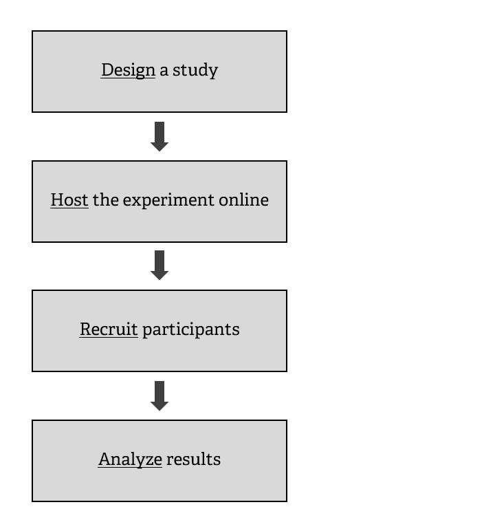
```

---

# Where does IBEX fit?

```{r, echo = FALSE, fig.align='center', out.width="450px"}
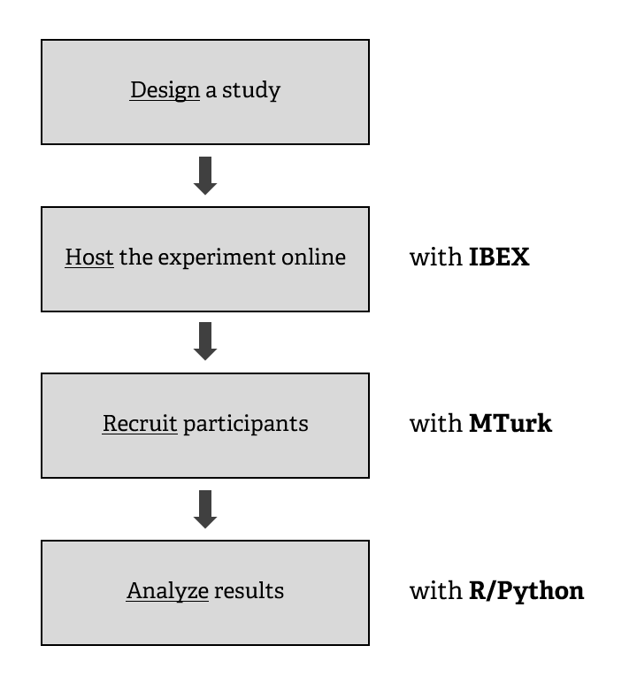
```

---

# Navigating IBEX

- <p>Go to <a href='https://spellout.net/ibexfarm'>https://spellout.net/ibexfarm</a> </p>

- Click <strong style='color:#006295'>create an account</strong> (or <strong style='color:#006295'>log in</strong>)

- Click <strong style='color:#006295'>manage my experiments</strong>

- Click <strong style='color:#006295'>Create a new experiment</strong>

- Give it a unique name like "_workshop_example_"

- Done!

```{r, echo = FALSE, fig.align='center', out.width="500px", out.extra='style="border:2px solid black; margin:auto; display:block;margin-top:30px"'}
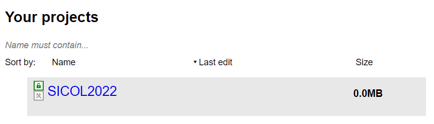
```

---

<h1 style='margin-bottom:0px'>Navigating Ibex</h1>

<video controls width="800" height="500">
<source src="vid/ibex_login.mp4" type="video/mp4">
</video>

---

<h1 style='margin-bottom:0px'>Experiment file structure</h1>

.pull-left[

**chunk_includes**
- Stand-alone files go here

**css_includes**
- Style specifications go here

**data_includes**
- Experiment scripts go here

**js_includes**
- Modules ("controllers") go here

**results** & **server_state**
- Automatically generated/updated

]


.pull-right[
```{r, echo = FALSE, out.width = "280px"}
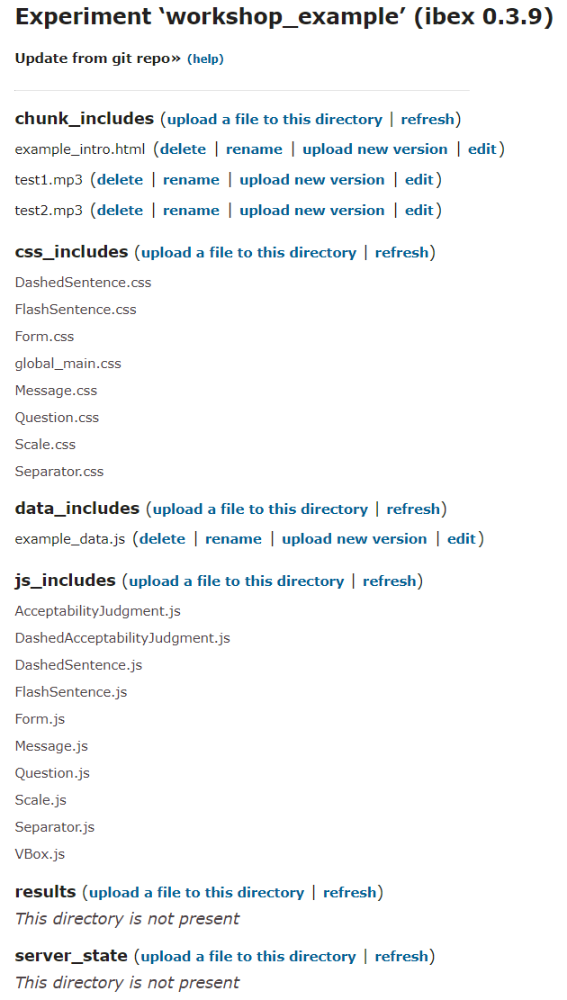
```
]

---

```{css, echo = FALSE}
.deemph {
  color: #bebebe;
}
```


<h1 style='margin-bottom:0px'>Experiment file structure</h1>

.pull-left[

<strong style='color:#bebebe'>chunk_includes</strong>
- .deemph[Stand-alone files go here]

<strong style='color:#bebebe'>css_includes</strong>
- .deemph[Style specifications go here]

**data_includes**
- Experiment scripts go here

<strong style='color:#bebebe'>js_includes</strong>
- .deemph[Modules ("controllers") go here]

<strong style='color:#bebebe'>results</strong> .deemph[&] <strong style='color:#bebebe'>server_state</strong>
- .deemph[Automatically generated/updated]

]


.pull-right[
```{r, echo = FALSE, out.width = "280px"}

```
]


---

class: middle, center

# 2. Scripting an experiment


---

# The script

Only need to modify **one file**: _example_data.js_ (can also be renamed later)

At creation, the default file looks like this:

<embed style='border: 1px solid black' type="text/html" src="ibex_files/example_data.js"  width="800" height="300">

The above script creates [this self-paced reading experiment](https://spellout.net/ibexexps/example/example/experiment.html).


---

# Writing your own script

The _example_data.js_ script works, but is not very friendly.

We'll use **our own** - <strong><a href="ibex_files/full_exp.js">template.js</a></strong> - to demonstrate how the script works.

<embed style='border: 1px solid black' type="text/html" src="ibex_files/full_exp.js"  width="800" height="300">

The above script creates [this acceptability rating experiment](https://spellout.net/ibexexps/skku_ibex/workshop_example/experiment.html).

---

# A simple layout

.pull-left[

```{r, echo = FALSE, out.width = "400px"}
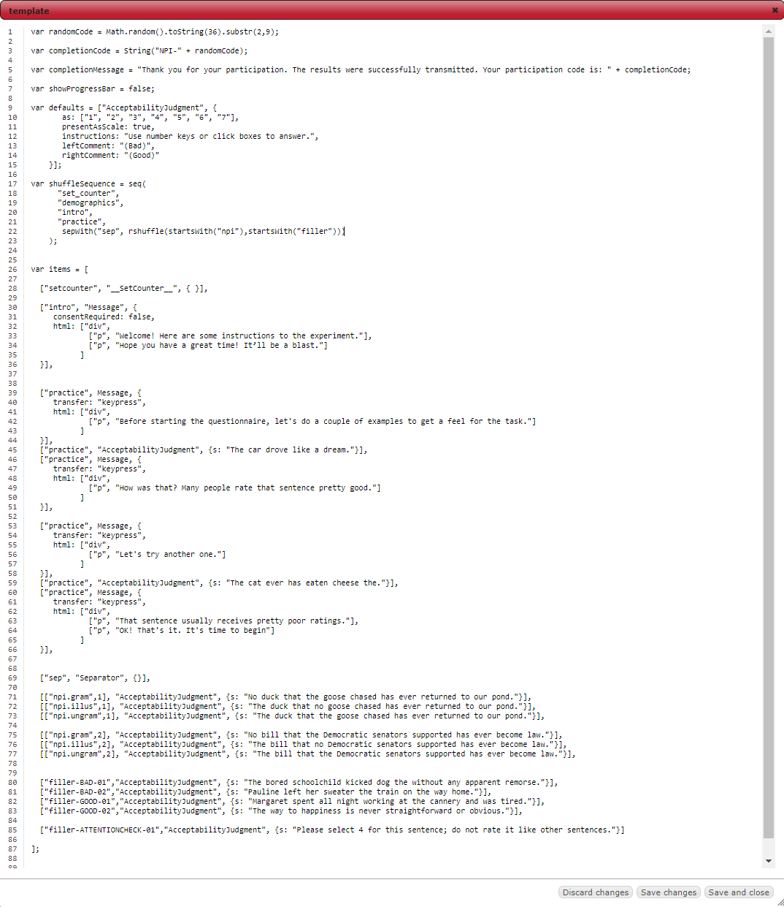
```

]


.pull-right[

**Editing the script**

When you open the `.js` file in the `data_includes` section of your experiment on Ibex, it will open up a text editor.

]

---

# A simple layout

.pull-left[

```{r, echo = FALSE, out.width = "400px"}

```

]


.pull-right[

**Editing the script**

When you open the `.js` file in the `data_includes` section of your experiment on Ibex, it will open up a text editor.

Options for editing the file:

- Make changes directly on IBEX

- Download the file and open with an .bl[editor] that supports **JavaScript** syntax checking (e.g., [Atom](https://atom.io/))

]

---

# A simple layout

.pull-left[

```{r, echo = FALSE, out.width = "400px"}
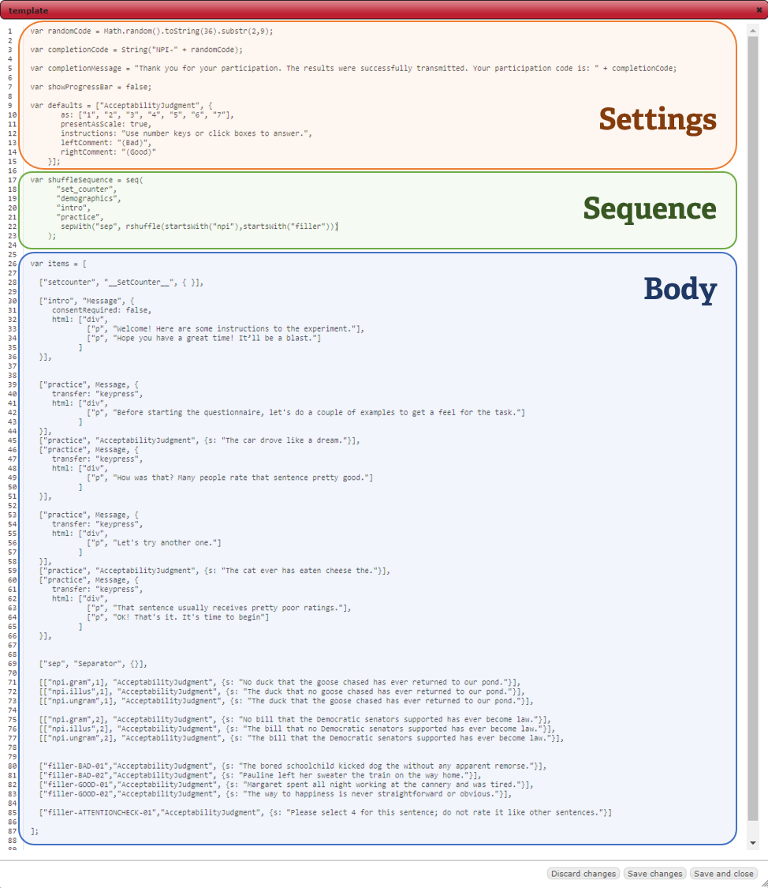
```

]


.pull-right[

**Parts of the Script**

.bl[Settings]:
- Sets various options for the experiment

.bl[Sequence] (`shuffleSequence`):

- Specifies the ordering of the different parts of the experiment

.bl[Body] (`items`):

- Includes the actual material that will be shown to the participants


]

---

# A simple layout

.pull-left[

```{r, echo = FALSE, out.width = "400px"}
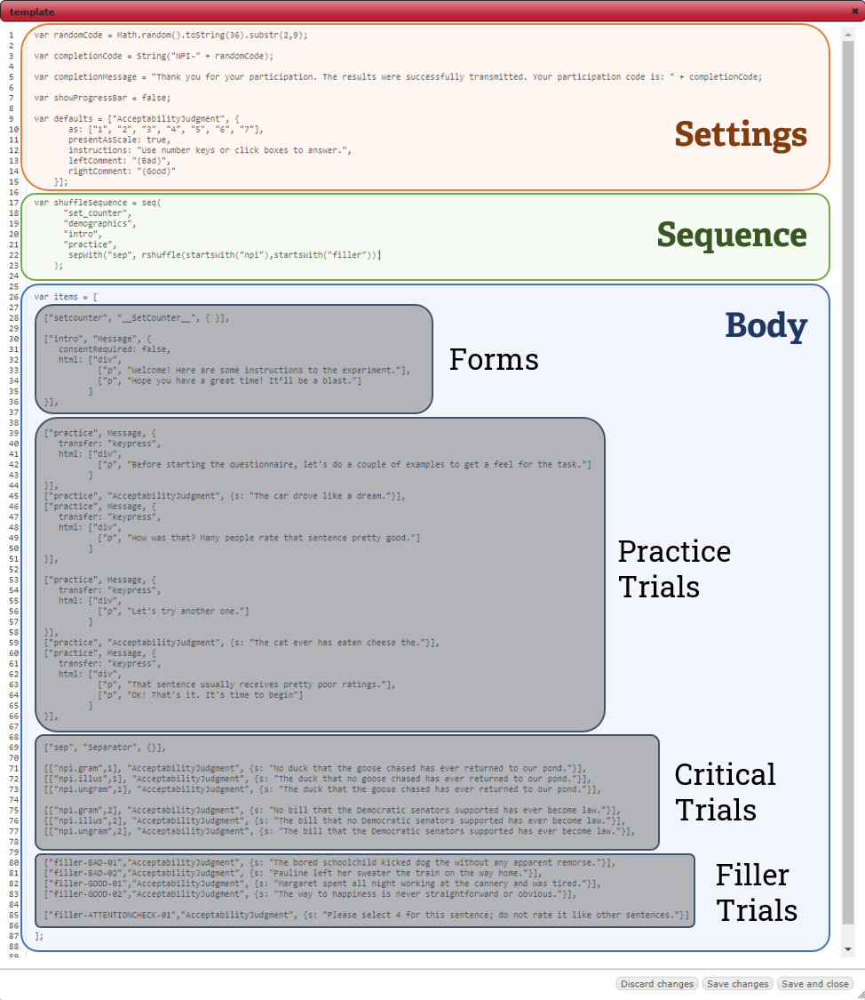
```

]


.pull-right[

**Body**

.bl[Forms]

- Introduction page, consent form, directions, language background, demographic information, etc.

.bl[Trials]

- All stimuli for the experiment

- _Practice_, _Critical_, _Filler_

- Can be accompanied by messages, questions, etc.

]

---

<h1 style='margin-bottom:0px'>Walkthrough of the components</h1>

```{r, echo = FALSE, fig.align='center', out.width = "500px"}
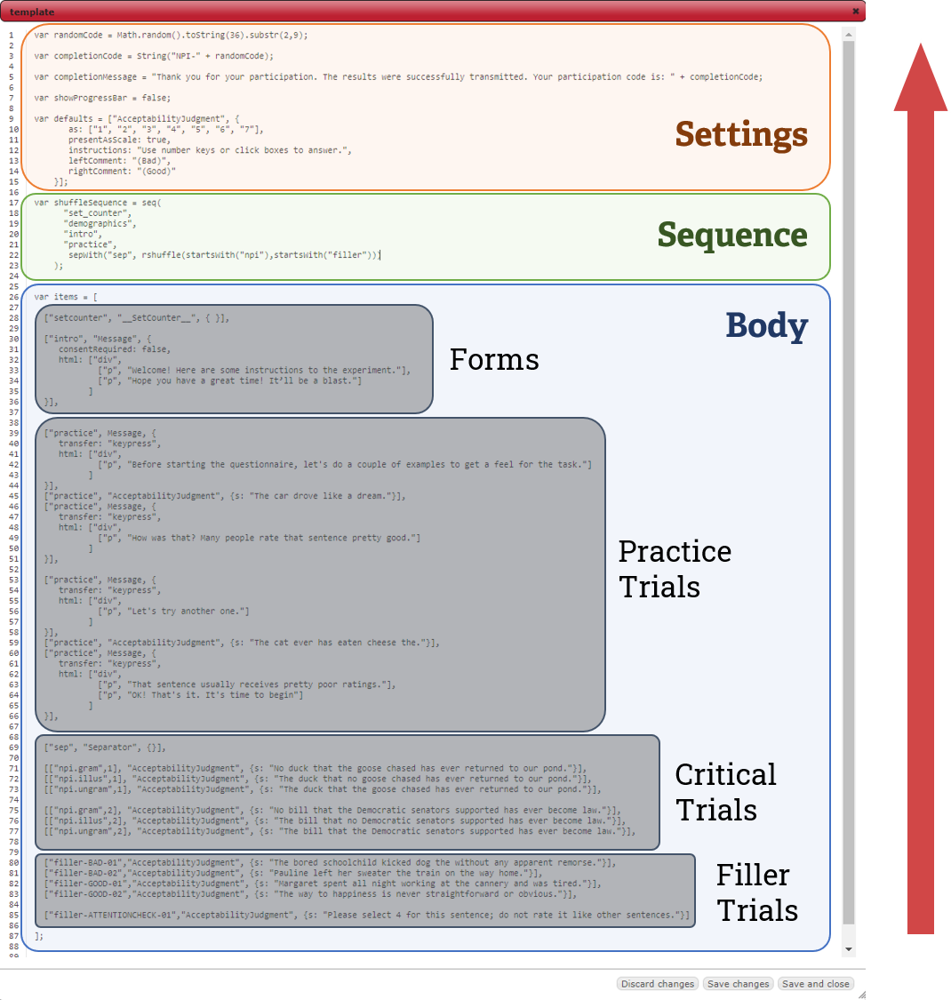
```

---

# Our first experiment

--

**Study**: We are interested in how people recover from .bl[garden-path sentences].

--

.center["While Anna dressed the kitten paid attention."]

--

.center[... *[.sub[VP] dressed the kitten], ...]

--

.center[... <span style='vertical-align:super; font-size:.7em'>✓</span>[.sub[VP] dressed], the kitten ...]

--

**Hypothesis**: Verbs that are frequently .blue[transitive] make recovery more difficult, compared to verbs that are frequently .green[intransitive].

--

.center[(transitive) - "While Anna .blue[_trained_] the kitten paid attention."]

--

.center[(intransitive) - "While Anna .green[_dressed_] the kitten paid attention."]

--

**Prediction**: Lower .bl[acceptability ratings] in the transitive condition (.blue[_gp.trans_]) than in the intransitive condition (.green[_gp.intrans_]).

--

<br>

.center[.bl[Note: this is a _within-participant_ design!]]


---

# Trial Syntax

For each trial in our acceptability judgment experiment, we write this code:

.center[.bl[[["_Trial name_", _Set #_], "_Trial Type_", {s: "_Sentence_"}]]]

--

This is a list (array) of three elements (clearer with spacing):

--

.pull-left[

.bg-washed-green.b--dark-green.ba.bw2.br3.shadow-5.ph3[

\[
<br>
$\quad$
\["_Trial name_", _Set #_ \],
<br>
$\quad$
"_Trial Type_",
<br>
$\quad$
{s: "Sentence"}
<br>
\]

]

]


.pull-right[
<p style='margin:1em'></p>
.bg-washed-green.b--dark-green.ba.bw2.br3.shadow-5.ph3[

\[
\["_Trial name_", _Set #_ \],
<br>
$\quad$
"_Trial Type_",
<br>
$\quad$
{s: "Sentence"}
\]

]

]


--

<p style='padding-top:25px'>We have one big bracket which contains <strong>three elements</strong>:</p>

1. Another list, consisting of the _name of the trial_ and _set number_

2. A string specifying the _type of the trial_ (called .bl[Controllers])

3. A curly bracket (_braces_), which has "s" and the _sentence_ separated by a colon

---

# Translating the design to code

.bl[Example 1:]

For the gp.trans condition, the first stimuli in our acceptability judgment experiment is the sentence "While Anna trained the kitten paid attention".

.bg-washed-green.b--dark-green.ba.bw2.br3.shadow-5.ph4[
\[
<br>
$\quad$
\[ "gp.trans", 1 \],
<br>
$\quad$
"AcceptabilityJudgment",
<br>
$\quad$
{s: "While Anna trained the kitten paid attention."}
<br>
\]
]

---

# Translating the design to code

.bl[Example 1:]

For the .blue[gp.trans condition], the first stimuli in our acceptability judgment experiment is the sentence "While Anna trained the kitten paid attention".

.bg-washed-green.b--dark-green.ba.bw2.br3.shadow-5.ph4[
\[
<br>
$\quad$
\[ ".blue[gp.trans]", 1 \],
<br>
$\quad$
"AcceptabilityJudgment",
<br>
$\quad$
{s: "While Anna trained the kitten paid attention."}
<br>
\]
]

---

# Translating the design to code

.bl[Example 1:]

For the .blue[gp.trans condition], the **first stimuli** in our acceptability judgment experiment is the sentence "While Anna trained the kitten paid attention".

.bg-washed-green.b--dark-green.ba.bw2.br3.shadow-5.ph4[
\[
<br>
$\quad$
\[ ".blue[gp.trans]", **1** \],
<br>
$\quad$
"AcceptabilityJudgment",
<br>
$\quad$
{s: "While Anna trained the kitten paid attention."}
<br>
\]
]

---

# Translating the design to code

.bl[Example 1:]

For the .blue[gp.trans condition], the **first stimuli** in our .bl[acceptability judgment experiment] is the sentence "While Anna trained the kitten paid attention".

.bg-washed-green.b--dark-green.ba.bw2.br3.shadow-5.ph4[
\[
<br>
$\quad$
\[ ".blue[gp.trans]", **1** \],
<br>
$\quad$
".bl[AcceptabilityJudgment]",
<br>
$\quad$
{s: "While Anna trained the kitten paid attention."}
<br>
\]
]

---

# Translating the design to code

.bl[Example 1:]

For the .blue[gp.trans condition], the **first stimuli** in our .bl[acceptability judgment experiment] is the .purple[sentence] "While Anna trained the kitten paid attention". 

.bg-washed-green.b--dark-green.ba.bw2.br3.shadow-5.ph4[
\[
<br>
$\quad$
\[ ".blue[gp.trans]", **1** \],
<br>
$\quad$
".bl[AcceptabilityJudgment]",
<br>
$\quad$
{.purple[s]: "While Anna trained the kitten paid attention."}
<br>
\]
]

---

# Translating the design to code

.bl[Example 1:]

For the .blue[gp.trans condition], the **first stimuli** in our .bl[acceptability judgment experiment] is the .purple[sentence] .orange["While Anna trained the kitten paid attention"]. 

.bg-washed-green.b--dark-green.ba.bw2.br3.shadow-5.ph4[
\[
<br>
$\quad$
\[ ".blue[gp.trans]", **1** \],
<br>
$\quad$
".bl[AcceptabilityJudgment]",
<br>
$\quad$
{.purple[s]: .orange["While Anna trained the kitten paid attention."]}
<br>
\]
]

--

This can be put into a single line:

```{r, eval=FALSE}
[["gp.trans",1], "AcceptabilityJudgment", {s: "While Anna trained the kitten paid attention."}]
```

---

# Translating the design to code

.bl[Example 2:]

For the .green[gp.intrans condition], the **first stimuli** in our .bl[acceptability judgment experiment] is the .purple[sentence] .orange["While Anna dressed the kitten paid attention"]. 

.bg-washed-green.b--dark-green.ba.bw2.br3.shadow-5.ph4[
\[
<br>
$\quad$
\[ ".green[gp.intrans]", **1** \],
<br>
$\quad$
".bl[AcceptabilityJudgment]",
<br>
$\quad$
{.purple[s]: .orange["While Anna dressed the kitten paid attention."]}
<br>
\]
]

This can be put into a single line:

```{r, eval=FALSE}
[["gp.intrans",1], "AcceptabilityJudgment", {s: "While Anna dressed the kitten paid attention."}]
```

---

# Practice

Item set #2:

.center[(transitive) - "Since Dave improved the department was satisfied."]

.center[(intransitive) - "Since Dave worried the counselor devised a plan."]

.can-edit[
```{r, eval=FALSE}
<code here>
```
]

<div class="showme">Hover for answer</div>

.hide[
```{r, eval = FALSE}
[["gp.trans",2],
  "AcceptabilityJudgment",
  {s: "Since Dave improved the department was satisfied."}]
[["gp.intrans",2],
  "AcceptabilityJudgment",
  {s: "Since Dave worried the counselor devised a plan."}]
```
]


---

# Putting together the stimuli

Wrap in `var items = []` and separate by a .bl[comma]:

<embed style='border: 1px solid black' type="text/html" src="snippets/critical_trials.js"  width="800" height="200">

--

Good scripting habits:

- Grouping item sets together and separating sets with new line

- Adding comments (starts with two or more slashes `//`)

- Saving often! (editing in IBEX not recommended)

---

# Practice and Fillers

.bl[Practice Trials]:

- Presented at the beginning, accompanied by instructions and feedback

--

.bl[Filler Trials]:

- Mixed in with the critical trials

--

.center[**Both types of trials are invariant across conditions**]

This means that the _first element_ of the big bracket can just be the _name of the stimuli_.

--

.panelset[
.panel[.panel-name[Practice]

Practice #1: "The car drove like a dream"

```{r, eval = FALSE}
["practice-1",
 "AcceptabilityJudgment",
 {s: "The car drove like a dream."}]
```

]

.panel[.panel-name[Filler-good]

Good Filler #1: "When Harry fell, the audience was shocked."

```{r, eval = FALSE}
["filler-good-01",
 "AcceptabilityJudgment",
 {s: "When Harry fell, the audience was shocked."}]
```

]

.panel[.panel-name[Filler-bad]

Bad Filler #1: "When Tyler sneezed the driver, he passed a tissue."

```{r, eval = FALSE}
["filler-bad-01",
 "AcceptabilityJudgment",
 {s: "When Tyler sneezed the driver, he passed a tissue."}]
```

]

.panel[.panel-name[Filler-catch]

Catch Filler #1: "Please select 4 for this sentence."

```{r, eval = FALSE}
["filler-catch-01",
 "AcceptabilityJudgment",
 {s: "Please select 4 for this sentence."}]
```

]
]

---

<h1 style='margin-bottom:20px'>Putting together the Body</h1>

<embed style='border: 1px solid black' type="text/html" src="snippets/all_trials.js"  width="800" height="420">

--

**Important**: The ordering of the trials here is just for human readability. We haven't yet told the program what order to present them in!


---

# Defining the Sequence

.pull-left[

<embed style='border: 1px solid black' type="text/html" src="snippets/all_trials.js"  width="350" height="450">

]

.pull-right[

.bl[List the _names_ of each trial in order:]

```{eval=FALSE}
 "practice-1",
 "gp.trans",
 "gp.intrans",
 "gp.trans",
 "gp.intrans",
 "filler-good-01",
 "filler-bad-01",
 "filler-catch-01"
```

]

---

# Defining the Sequence

.pull-left[

<embed style='border: 1px solid black' type="text/html" src="snippets/all_trials.js"  width="350" height="450">

]

.pull-right[

.bl[Wrap them in `seq()`:]

```{eval=FALSE}
seq(
 "practice-1",
 "gp.trans",
 "gp.intrans",
 "gp.trans",
 "gp.intrans",
 "filler-good-01",
 "filler-bad-01",
 "filler-catch-01"
)
```

]

---

# Defining the Sequence

.pull-left[

<embed style='border: 1px solid black' type="text/html" src="snippets/all_trials.js"  width="350" height="450">

]

.pull-right[

.bl[Assign to `shuffleSequence`:]

```{r eval=FALSE}
var shuffleSequence = seq(
 "practice-1",
 "gp.trans",
 "gp.intrans",
 "gp.trans",
 "gp.intrans",
 "filler-good-01",
 "filler-bad-01",
 "filler-catch-01"
)
```

]

---

# Defining the Sequence

.pull-left[

<embed style='border: 1px solid black' type="text/html" src="snippets/all_trials.js"  width="350" height="450">

]

.pull-right[

.bl[Assign to `shuffleSequence`:]

```{r eval=FALSE}
var shuffleSequence = seq(
 "practice-1",
 "gp.trans",
 "gp.intrans",
 "gp.trans",
 "gp.intrans",
 "filler-good-01",
 "filler-bad-01",
 "filler-catch-01"
)
```

The `shuffleSequence` variable handles the _order of presentation_ of the .bl[experiment materials] that are stored inside the `items` variable.

]

---

# Defining the Sequence

.pull-left[

<embed style='border: 1px solid black' type="text/html" src="snippets/all_trials.js"  width="350" height="450">

]

.pull-right[

**Problems**

```{r eval=FALSE}
var shuffleSequence = seq(
 "practice-1", #<<
 "gp.trans", 
 "gp.intrans",
 "gp.trans", 
 "gp.intrans",
 "filler-good-01", #<<
 "filler-bad-01", #<<
 "filler-catch-01" #<<
)
```

1. A lot of typing ("-02", "-03", ...)

]

---

# Defining the Sequence

.pull-left[

<embed style='border: 1px solid black' type="text/html" src="snippets/all_trials.js"  width="350" height="450">

]

.pull-right[

**Problems**

```{r eval=FALSE}
var shuffleSequence = seq(
 "practice-1",
 "gp.trans", #<<
 "gp.intrans", #<<
 "gp.trans", #<<
 "gp.intrans", #<<
 "filler-good-01", #<<
 "filler-bad-01", #<<
 "filler-catch-01" #<<
)
```

1. A lot of typing ("-02", "-03", ...)

2. Presentation order of some trials should be random

]


---

# Defining the Sequence

.pull-left[

<embed style='border: 1px solid black' type="text/html" src="snippets/all_trials.js"  width="350" height="450">

]

.pull-right[

**Problems**

```{r eval=FALSE}
var shuffleSequence = seq(
 "practice-1",
 "gp.trans", #<<
 "gp.intrans", #<<
 "gp.trans", #<<
 "gp.intrans", #<<
 "filler-good-01",
 "filler-bad-01",
 "filler-catch-01"
)
```

1. A lot of typing ("-02", "-03", ...)

2. Presentation order of some trials should be random

3. How do we counterbalance critical trials?


]

---

# Sequence: multiple selection

<p style='margin-block-end:0;'>To save us from writing repetitive code, we use <code>startsWith()</code></p>

.pull-left[
```{r eval=FALSE}
var shuffleSequence = seq(
 "practice-1", #<<
 "gp.trans",  #<<
 "gp.intrans", #<<
 "gp.trans",  #<<
 "gp.intrans",  #<<
 "filler-good-01", #<<
 "filler-bad-01", #<<
 "filler-catch-01" #<<
)
```
]

.pull-right[

```{r eval=FALSE}
var shuffleSequence = seq(
 startsWith("practice"), #<<
 startsWith("gp") #<<
 startsWith("filler") #<<
)
```
]

--

The function `startsWith()` matches all names that starts with the given string.

---

# Sequence: randomization

<p style='margin-block-end:0;'>To mix critical and filler trials in random order, we use <code>rshuffle()</code></p>

.pull-left[
```{r eval=FALSE}
var shuffleSequence = seq(
 startsWith("practice"),
 startsWith("gp") #<<
 startsWith("filler") #<<
)
```
]

.pull-right[

```{r eval=FALSE}
var shuffleSequence = seq(
 startsWith("practice"),
 rshuffle( #<<
   startsWith("gp"), #<<
   startsWith("filler") #<<
 ) #<<
)
```
]

--

By wrapping both the critical trials (_gp..._) and the filler trials (_filler..._) in `rshuffle()`, they are mixed together and presented in random order.

--

We can also write this out more compactly:

```{r eval=FALSE}
var shuffleSequence = seq(
 startsWith("practice"),
 rshuffle(startsWith("gp"), startsWith("filler")) #<<
)
```

---

# Sequence: counterbalancing

The .bl[set number] in our critical trials automatically handles **counterbalancing**:

.center[[["gp.trans", .bl[1]], ...], [["gp.intrans", .bl[1]], ...], [["gp.trans", .bl[2]], ...], [["gp.intrans", .bl[2]], ...]]

--

```{r, echo = FALSE, fig.align='center', out.width="700px"}
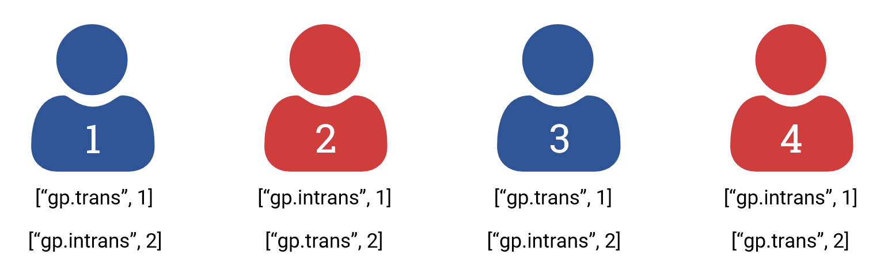
```

--

We just need to add a .bl[counter] inside `items` to track group assignment:

```{eval=F}
["setcounter", "__SetCounter__", { }]
```


---

# Sequence: counterbalancing

Adding the counter to the experiment is simple:

```{r eval=FALSE}
var shuffleSequence = seq(
  "setcounter", 
  ...
)

var items = [
  
  ["setcounter", "__SetCounter__", { }], 
  ...
  
]
```

--

**Note**: Sometimes you want to place "setcounter" in the _middle_ of the experiment

```{r eval=FALSE}
var shuffleSequence = seq(
  "intro"
  "consent",
  "setcounter", 
  ...
)
```

---

# Body and Sequence together

<embed style='border: 1px solid black' type="text/html" src="snippets/body_sequence.js"  width="800" height="400">

--

Just need one more step: **Settings**

---

# Settings (Basic)

Consist of miscellaneous options that we can put at the top of the script.

--

At the very least, we want to do two things:

1. Generate unique **participant IDs**

2. Specify the parameters for the **method design**


---

# Settings (Basic)

Consist of miscellaneous options that we can put at the top of the script.

At the very least, we want to do two things:

1. Generate unique **participant IDs** (`randomCode`)

2. Specify the parameters for the **method design** (`defaults`)

<embed style='border: 1px solid black' type="text/html" src="snippets/settings.js"  width="800" height="245">

--

More details in the .bl[AcceptabilityJudgment] section of the [documentation](https://github.com/addrummond/ibex/blob/master/docs/manual.md).


---

# `defaults` variable

The specifications in `defaults` set the design of the trials:

```{eval=F}
var defaults = [
    "AcceptabilityJudgment", {
       as: ["1", "2", "3", "4", "5", "6", "7"],           
       presentAsScale: true,                             
       instructions: "Use number keys or click boxes to answer.",    
       leftComment: "(Bad)",
       rightComment: "(Good)"
    }]
```

--

```{r, echo=F, out.width = '550px', out.extra="style='border:1px solid black; margin:auto; display:block;'"}
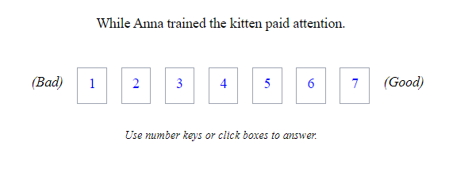
```


---

# Settings (Miscellaneous)

You can also change other options, such as showing a message at the end:

.center[`var completionMessage`]

```{eval=F}
//// A message to show to participants at completion (useful for confirmation, raffle entry, etc.)
var completionMessage = "Thank you for your participation. Your participation code is: " + randomCode
```

--

And whether to show a progress bar:

.center[`var showProgressBar`]

```{eval=F}
//// Show a progress bar at the top? (true/false)
var showProgressBar = false
```

--

You can learn more about these various elements in the .bl[Miscellaneous options] section of the [documentation](https://github.com/addrummond/ibex/blob/master/docs/manual.md).

---

# A minimal experiment

We now have a [minimally working experiment](https://spellout.net/ibexexps/skku_ibex/workshop_minimal/experiment.html)!

<embed style='border: 1px solid black' type="text/html" src="ibex_files/minimal_exp.js"  width="800" height="400">

---

# Interim Summary #1

.bl[What we've covered:]

--

- <p>We use a special syntax to create stimuli</p>

--

- We store all the materials for our experiment inside `items`

--

- We specify the order of presentation inside `shuffleSequence`

--

- We set various options at the top of the script, such as defaults for the experiment _method_ and the assignment of _participant ID_

--

.bl[A few more things to know:]

--

- How can we add _plain text_?

    - Introduction page, consent form, directions, etc.
    
--
    
- How can we extend this workflow for _other experimental designs_?

    - Self-paced reading, comprehension tasks, etc.

---

# The "Message" controller

The **"Message"** controller shows text on a new page.

--

It is a list of 3 elements, similar to the "AcceptabilityJudgement" items:

.center[.bl[["_Trial name_", "Message", {html: _text_}]]]

--

- .bl[_Trial name_] is used to reference the trial in sequencing, as seen earlier 

--

- .bl["Message"] tells IBEX that this trial just shows text on a new screen

--

- Inside of the curly braces .bl[{}] we can add text in the .bl[html] parameter:

```{r, eval=FALSE}
["intro", "Message", {html: ["p", "Welcome to the experiment!"]}]
```

--

Notes on .bl[html]:

The code `["p", "<your text here>"]` prints a single paragraph of text.

The "p" is called a .bl[tags] and there are [many others](https://www.w3schools.com/TAGs/), but usually messages don't get more complicated than simple paragraphs.

---

# Message examples

.panelset[
.panel[.panel-name[1-paragraph]

A message composed of a single paragraph:

```{r, eval = FALSE}
["intro", "Message", {html: ["p", "Welcome to the experiment!"]}]
```

```{r, echo=F, out.width = '300px', out.extra="style='border:1px solid black; margin:auto; display:block;'"}
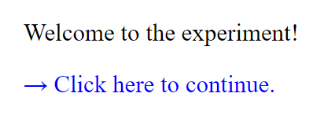
```

]

.panel[.panel-name[n-paragraphs]

A message composed of multiple paragraphs must be combined inside a "div":

```{r, eval = FALSE}
["intro", "Message", {html:
    ["div", #<<
      ["p", "Welcome to the experiment!"],
      ["p", "Here's another paragraph."],
      ["p", "These paragraphs are all wrapped inside \"div\"."]
    ] #<<
}]
```

```{r, echo=F, out.width = '300px', out.extra="style='border:1px solid black; margin:auto; display:block;'"}
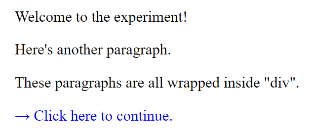
```

**Note**: You can .bl[escape] special characters like quotes `"` with a backslash `\`

]

.panel[.panel-name[consent]

Ask for consent with a set of `consent...` parameters

```{r, eval = FALSE}
["consent", "Message", {
  html: ["p", "Do you consent?"],
  consentRequired: true, #<<
  consentMessage: "I consent." #<<
}]
```

```{r, echo=F, out.width = '300px', out.extra="style='border:1px solid black; margin:auto; display:block;'"}
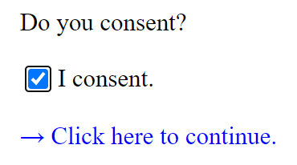
```

]

.panel[.panel-name[keypress]

Use the `transfer` argument to specify how the participant can move on.

Setting `transfer` to `"keypress"` removes the default ".blue[Click here to continue.]" message and allows participants to proceed with the press of any key.

```{r, eval = FALSE}
["move_on", "Message", {
  html: ["div", 
          ["p", "The option for \"transfer\" is \"keypress\""],
          ["em", "Press any key to continue."]
        ],
  transfer: "keypress" #<<
}]
```

```{r, echo=F, out.width = '300px', out.extra="style='border:1px solid black; margin:auto; display:block;'"}
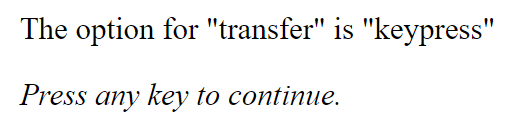
```

]

.panel[.panel-name[separator]

You might want to insert a page that separates the trials:

```{r, eval = FALSE}
["sep", "Message", {
  html: ["em", "Press any key to continue."],
  transfer: "keypress"
}]
```

```{r, echo=F, out.width = '300px', out.extra="style='border:1px solid black; margin:auto; display:block;'"}
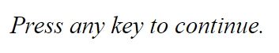
```

You can do so using `sepWith()` in `shuffleSequence`:

```{r, eval=F}
var shuffleSequence = seq(
  "practice",
  sepWith("sep", rshuffle(startsWith("gp"), startsWith("filler"))) #<<
)
```

]
]

---

# Putting everything together

Here's a [complete experiment](https://spellout.net/ibexexps/skku_ibex/workshop_acceptabilityJudgment/experiment.html) with several .bl[Message] controllers added.

<embed style='border: 1px solid black' type="text/html" src="ibex_files/full_exp.js"  width="800" height="420">


---

# Getting the experiment up

So we have a new script, but how do we host the experiment?

1. Go to the [IBEX website](https://spellout.net/ibexfarm/) and log in.

2. Click on your experiment (or create one if you haven't already).

3. Click .blue[edit] next to the <em>example_data.js</em> file in the **data_includes** section.

4. Delete its contents and copy paste your new code.

5. Click on the link at the top of the page.

```{r, echo=F, out.width = '400px', fig.align='center'}
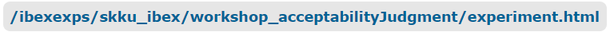
```

The URL shown in your browser is the link to your experiment!

```{r, echo=F, out.width = '400px', fig.align='center'}
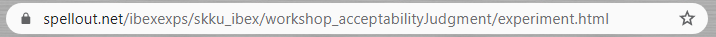
```

.center[https://spellout.net/ibexexps/skku_ibex/workshop_minimal/experiment.html]

---

# Making a different experiment

Suppose that after a _pilot experiment_, we find acceptability judgments to be inappropriate for answering our research question.

--

We want a _finer-grained measure_ of recovery difficulty, so we'd like to change the experiment to **self-paced reading** and look at differences in _reading time_.

&nbsp;

--

Given our existing template, we take the following steps:

--

1. Go to the [documentation](https://github.com/addrummond/ibex/blob/master/docs/manual.md) and find a Controller for self-paced reading.

--

2. Specify the design of that controller in the `defaults` variable.

--

3. Change our trials in `items` from ".bl[acceptabilityJudgment]" to that Controller.

--

4. Make changes to the text of the ".bl[Messages]" items (e.g., directions).

--

Let's go look at the documentation!

---

# "DashedSentence" Controller

The .bl["DashedSentence"] Controller creates self-paced reading trials.

We first re-write `defaults` to specify appropriate settings for .bl["DashedSentence"].

```{r, eval=F}
var defaults = [
    "DashedSentence", {
       mode: "self-paced reading",
       display: "dashed"
    }]
```

Then, we replace .bl["acceptabilityJudgment"] with .bl["DashedSentence"] in `items`.

```{r, eval=F}
var items = [
  ...
  [["gp.trans",1], "DashedSentence", {s: "While Anna trained the kitten paid attention."}],
  [["gp.intrans",1], "DashedSentence", {s: "While Anna dressed the kitten paid attention."}],
  [["gp.trans",2], "DashedSentence", {s: "Since Dave improved the department was satisfied."}],
  [["gp.intrans",2], "DashedSentence", {s: "Since Dave worried the counselor devised a plan."}],
  ...
]
```


---

# Our second experiment

Finally, after re-writing some of the ".bl[Message]" items, we have a [new experiment](https://spellout.net/ibexexps/skku_ibex/workshop_DashedSentence/experiment.html)!

<embed style='border: 1px solid black' type="text/html" src="ibex_files/SPR.js"  width="800" height="420">


---

class: middle, center

# 3. Analysis of the results

---

# Where to find the data

The data collected in the experiment can be found on the experiment page, under the .bl[results] section.

```{r, echo=F, out.width = '600px', out.extra="style='border:1px solid black; margin:auto; display:block;'"}
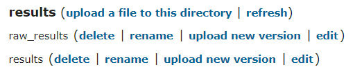
```

The section comprises of two files, of which *results* is the better formatted one.

---

<h1 style='margin-bottom:0px'>The <em>results</em> file</h1>

*results* is a .bl[csv] file (.bl[c]omma .bl[s]eparated .bl[v]alues), meaning that each line contains a set of values that are separated by a comma.

--

```{r, echo=F, out.width = '550px', out.extra="style='border:1px solid black; margin:auto; display:block;'"}
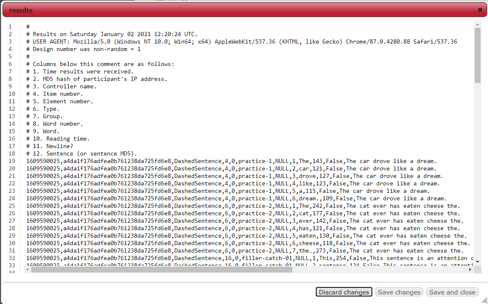
```

--

The lines that start with a pound symbol "#" are .b[comments] that include _metadata_.

They tell us what **variables** each comma-separated values correspond to.

---

# The **variables**

All IBEX experiments return these **7** variables:

1. .blue[Time]

2. .blue[Participant ID]

3. .blue[Controller Name]

4. .blue[Item number]

5. .blue[Element number]

6. .blue[Type]

7. .blue[Group]

---

# The **variables**

Generally, we only care about **4** of these:

1. .deemph[Time]

2. .blue[Participant ID]: A unique ID for each participant.

3. .blue[Controller Name]: The controller that the values are from.

4. .deemph[Item number]

5. .deemph[Element number]

6. .blue[Type]: The name of the trial.

7. .blue[Group]: The item group number.

--

The last two variables uniquely identify each trial created in `items`:

--

.center[.bl[[[.blue["_Type_"], .blue[_Group_]], "_Trial Type_", {s: "_Sentence_"}]]]

.center[.bl[[[.blue["gp.trans"], .blue[1]], "DashedSentence", {s: "..."}]]]

---

# The **variables**

Depending on the experiment, IBEX returns other variables specific to the design.

--

For self-paced reading with .b["DashedSentence"], we get **5** more variables:

8. .green[Word number] - The index of the word in the sentence.

9. .green[Word] - The text of that word.

10. .green[Reading time] - Reading time for that word.

11. .green[Newline?] - 0 or 1 indicating whether there was a line break.

12. .green[Sentence] - The text of the sentence.

--

These are also outlined in the [documentation](https://github.com/addrummond/ibex/blob/master/docs/manual.md) for .bl["DashedSentence"], so you know what variables to expect beforehand.

--

For an actual analysis of the results, we need the results to be imported somewhere as a **data frame** (where every value is a cell and each variable forms a column). 

---

# Importing - Excel

Steps for importing the data into Excel:

1. Copy the text of the _results_ file from IBEX

2. Paste into the first column of an Excel spreadsheet

3. Highlight that column and click .bl[Data] tab -> .bl[Filter]

4. Click on the dropdown arrow that appears at the top cell

5. Click .bl[Text Filters] -> .bl[Begins With...] and type in "#"

6. Go to .bl[Home] tab -> .bl[Find & Select], check "Visible cells only", and click OK

7. Right click on any part of the sheet and select .bl[Delete Row]

8. Click the first column again and go to .bl[Data] tab -> .bl[Text to Columns]

9. Check "Delimited", "Comma", then "General" for each prompt

10. Add an empty row at the top and manually type in the column names from the comments of the original _results_ file

---

<h1 style='margin-bottom:0px'>Importing - Excel</h1>

<video controls width="800" height="500">
<source src="vid/excel_import.mp4" type="video/mp4">
</video>

---

# Importing - R

Steps for importing into R:

1. Download the text of the _results_ file (as ".txt")

2. Open it with the `read_ibex()` function from [here](https://github.com/yjunechoe/IBEX-Workshop-Materials/blob/master/R%20codes/read_ibex.R)

--

```{r, echo = FALSE}
set.seed(20210122)
```

```{r}
# Load the script containing the `read_ibex()` function
source("R codes/read_ibex.R")
# Read in the results file
results <- read_ibex("ibex_files/SPR_results.txt")
# Sample a couple lines and exclude some columns
results[sample(nrow(results), 3), -c(1, 2, 4, 5, 11)]
```

