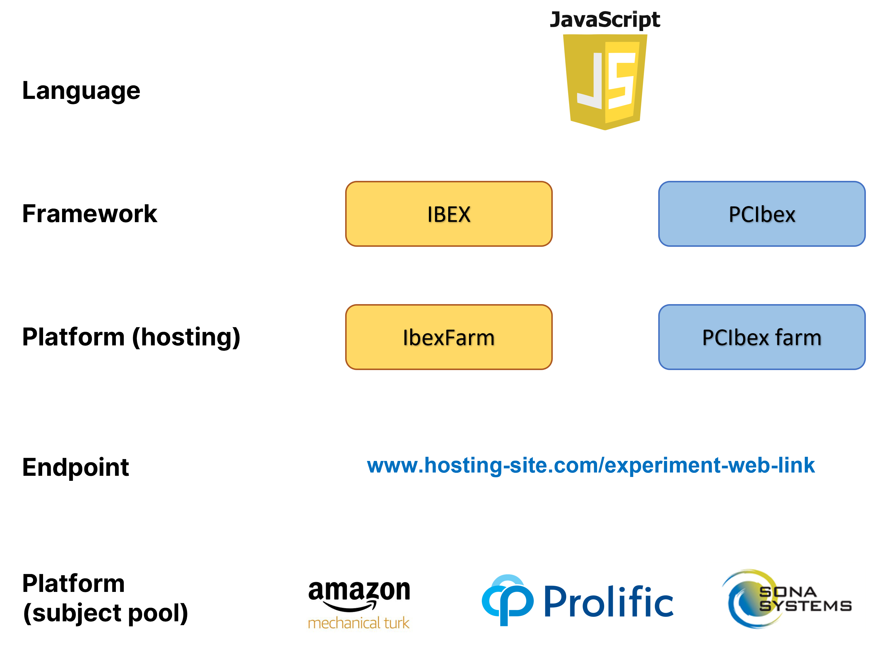
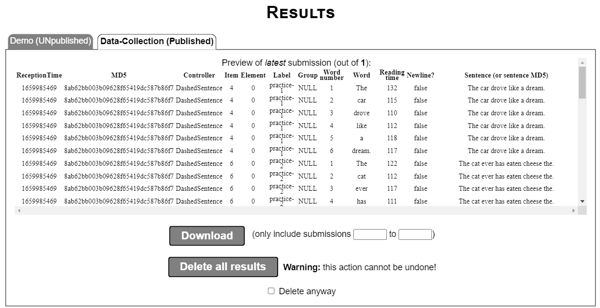
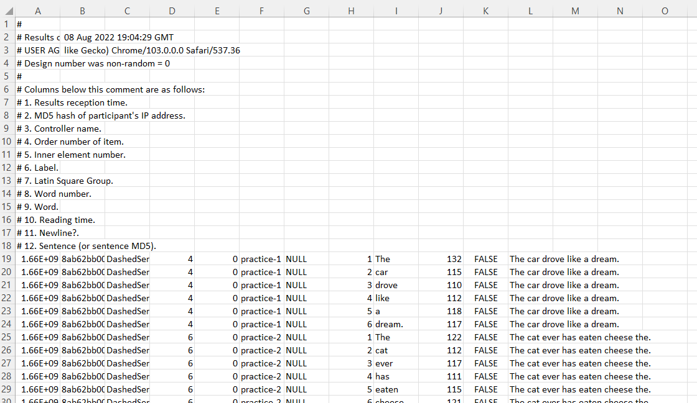
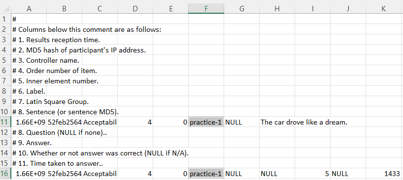

```{r setup, include=FALSE}
options(htmltools.dir.version = FALSE)
knitr::opts_chunk$set(comment = " ")
library(icon)
```

```{r xaringan-themer, include=FALSE, warning=FALSE}
library(xaringanthemer)
style_duo_accent(
  primary_color = "#011F5b",
  secondary_color = "#600018",
  inverse_header_color = "#FFFFFF"
)

xaringanExtra::use_xaringan_extra(c('tile_view', 'tachyons', 'editable', 'panelset'))

library(metathis)
meta() %>% 
  meta_social(
    title = "Experimental Syntax using IBEX",
    description = "A Walkthrough",
    url = "https://yjunechoe.github.io/IBEX-Workshop-Materials",
    image = "https://raw.githubusercontent.com/yjunechoe/IBEX-Workshop-Materials/master/Card_small.png",
    image_alt = "Title slide of Experimental Syntax using IBEX",
    twitter_card_type = "summary_large_image"
  )
```

```{css, echo = FALSE}
a {
  color: black;
  text-decoration: underline;
}

.remark-code-line-highlighted {
  margin-left: .6em;
}

.showme:hover + .hide {
  display: block;
}

.hide {
  display: none;
}
.hide:hover {
  display: block;
}

.hljs-github .hljs-keyword {
  color: black;
  font-weight:normal;
}

.hljs-github .hljs-literal {
  color: black;
}

.hljs-github .hljs-string {
  color: black;
}

.hljs-github .hljs-number {
  color: black;
}

.blue{
  font-weight: bold;
  color: #003087;
}

.green{
  font-weight: bold;
  color: #006747;
}

.orange{
  font-weight: bold;
  color: #FB5315;
}

.purple{
  font-weight: bold;
  color: #9312A0;
}

.bl {
  font-weight: bold;
  color: black;
  border: 0px;
}

.super{
  vertical-align: super;
  font-size: .5em;
}

.sub{
  vertical-align: sub;
  font-size: .5em;
 }

/*-- 3 column layout --*/
.left-col {
  width: 29%;
  text-align: left;
  padding-left: 20px;
  padding-right: 20px;
  float: left;
}

.center-col {
  width: 29%;
  text-align: left;
  padding-left: 20px;
  padding-right: 20px;
  float: left;
}

.right-col {
  width: 29%;
  text-align: left;
  padding-left: 20px;
  padding-right: 20px;
  float: left;
}

.pull-left {
  padding-top: 0px;
}

.pull-left-narrow {
  float: left;
  width: 20%;
}

.pull-right-wide {
  float: right;
  width: 75%;
}

.pull-left-about {
  float: left;
  width: 30%;
}

.pull-right-about {
  float: right;
  width: 64%;
}

.deemph {
  color: #bebebe;
}

/* Clear floats after the columns */
.pull-right-wide + * { clear: both; }
```

# About us

.pull-left-about[.center[
  
]]

.pull-right-about[.middle[]
  **Nayoun Kim** nayoun@skku.edu
  
  Assistant Professor, Sungkyunkwan University
  Department of English Language and Literature
  
  Syntax, Experimental Syntax, Psycholinguistics
  <br>
  <br>
  <br>
]

.pull-left-about[.center[
  
]]

.pull-right-about[.middle[]
  **June Choe** yjchoe@sas.upenn.edu
  
  Ph.D. Student, University of Pennsylvania
  Department of Linguistics
  
  Psycholinguistics, Acquisition, Computational Linguistics
]

---

# Presentation Outline

.pull-left-narrow[.center[
  
]]

.pull-right-wide[.middle[]
  Introduction to [IBEX](https://github.com/addrummond/ibex/blob/master/docs/manual.md) and [PCIbex](https://doc.pcibex.net/)
  - Basic ideas (IBEX code + PCIbex farm)
  - Navigating the platform
  - File structure
]

.pull-left-narrow[.center[
  &nbsp;
  `r icon_style(fontawesome("code", style = "solid"), scale = 4, fill = "#006747")`
]]

.pull-right-wide[
  Scripting an experiment
  - Overview of critical components
  - Code walkthrough
]

.pull-left-narrow[.center[
  &nbsp;
  `r icon_style(fontawesome("file", style = "solid"), scale = 4, fill = "#768692")`
]]

.pull-right-wide[
  Analysis of the results
  - Understanding the output format
  - Importing into Excel and R
]


---

class: middle, center

# 1. Introduction to IBEX and PCIbex

---

# What is IBEX and PCIbex?

--

**IBEX**

- (.bl[I])nternet-(.bl[B])ased (.bl[EX])periments developed by Alex Drummond.

- Refers to both the **framework for scripting experiments** and the **platform for hosting experiments**.

- IBEX the _platform_ ["IBEXfarm"](https://adrummond.net/ibexfarm) has been [discontinued in late 2021](https://groups.google.com/g/ibexexperiments/c/UMnpZgawfIc), but the IBEX _framework_ survives and is supported by extensions and spinoffs.

--

<br>

**PCIbex**

- PennController for IBEX developed by Jeremy Zehr and Florian Schwarz at the University of Pennsylvania.

- A platform for hosting experiments that **supports and extends IBEX**

- Also introduces its own, alternative framework for scripting experiments.

---

```{r, echo = FALSE, fig.align='center', out.width="800px"}

```

---

```{r, echo = FALSE, fig.align='center', out.width="800px"}

```

---

# Navigating the PCIbex platform

- <p>Go to the PCIbex farm <a href='https://farm.pcibex.net'>https://farm.pcibex.net</a> </p>

- **Sign up** with an email (or **Log in**)

- Once logged in, click **Empty project** under **Start a new project**

- Change the name of the project at the top to something unique (e.g., "SICOL2022")

- Your new project will appear on the main page

```{r, echo = FALSE, fig.align='center', out.width="600px", out.extra='style="border:2px solid black; margin:auto; display:block;margin-top:30px"'}

```

---

# PCIbex Dashboard Interface

```{r, echo = FALSE, fig.align='center', out.width="800px"}

```


---

# Experiment file structure

.pull-left-about[
```{r, echo = FALSE, out.width = "230px", out.extra="style='margin-top:-30px;'"}
knitr::include_graphics("img/file_structure.png")
```
]


.pull-right-about[

**Resources**
- Files for experiment materials go here

**Scripts**
- Experiment scripts go here

**Aesthetics**
- Style sheets go here

**Modules**
- Controllers (a.k.a. "Elements") go here

]

---

# Experiment file structure

.pull-left-about[
```{r, echo = FALSE, out.width = "230px", out.extra="style='margin-top:-30px;'"}
knitr::include_graphics("img/file_structure.png")
```
]

.pull-right-about[

<strong style='color:#bebebe'>Resources</strong>
- .deemph[Files for experiment materials go here]

**Scripts**
- Experiment scripts go here

<strong style='color:#bebebe'>Aesthetics</strong>
- .deemph[Style sheets go here]

<strong style='color:#bebebe'>Modules</strong>
- .deemph[Controllers (a.k.a. "Elements") go here]

]

---

class: middle, center

# 2. Scripting an experiment


---

# The script

When scripting with IBEX, we often only need **one file**: _main.js_

At creation, the default file looks like this:

<embed style='border: 1px solid black' type="text/html" src="ibex_files/main.js" width="750" height="135px">

This is a snippet of code from the **PCIbex scripting framework**, which is not the focus of the workshop today (we will briefly revisit PCIbex at the end).

---

# Writing your own script

To demonstrate the **IBEX scripting framework**, we use our own <strong><a href="ibex_files/full_exp.js">template file</a></strong>.

The following IBEX code _just works_ thanks to PCIbex's backward compatibility.

<embed style='border: 1px solid black' type="text/html" src="ibex_files/full_exp.js"  width="800" height="300">

This script creates an [acceptability judgment experiment](https://farm.pcibex.net/r/YBYAwi/).

---

# A simple layout

.pull-left[

```{r, echo = FALSE, out.width = "400px"}
knitr::include_graphics("img/template_layout_2.png")
```

]


.pull-right[

**Parts of the `main.js` Script**

.bl[Settings]:
- Sets various options for the experiment

.bl[Sequence]:

- Specifies the ordering of the different parts of the experiment

.bl[Body]:

- Includes the actual material that will be shown to the participants

]

---

# A simple layout

.pull-left[

```{r, echo = FALSE, out.width = "400px"}
knitr::include_graphics("img/template_layout_3.png")
```

]


.pull-right[

**Body**

.bl[Forms]

- Introduction page, consent form, directions, language background, demographic information, etc.

.bl[Trials]

- Stimuli for the experiment

    - **practice** trials
    
    - **critical** trials
    
    - **filler** trials

]

---

<h1 style='margin-bottom:0px'>Walkthrough of the components</h1>

```{r, echo = FALSE, fig.align='center', out.width = "500px"}
knitr::include_graphics("img/template_outline.png")
```

---

# Our first experiment

**Study**: We are interested in how people recover from .bl[garden-path sentences].

.center["While Anna dressed the kitten paid attention."]

.center[... *[.sub[VP] dressed the kitten], ...]

.center[... <span style='vertical-align:super; font-size:.7em'>✓</span>[.sub[VP] dressed], the kitten ...]

--

**Hypothesis**: Verbs that are frequently .blue[transitive] make recovery (reanalysis) more difficult, compared to verbs that are frequently .green[intransitive].

.center[(transitive-biased) - "While Anna .blue[_trained_] the kitten paid attention."]

.center[(intransitive-biased) - "While Anna .green[_dressed_] the kitten paid attention."]

--

**Prediction**: Lower .bl[acceptability ratings] in the transitive-biased condition (.blue[_gp.trans_]) than in the intransitive-biased condition (.green[_gp.intrans_]).

--

<div style = 'padding-top: 20px'>
.center[.bl[We also want a _within-participant_ design!]]
</div>

---

# Trial Syntax

For each trial in our acceptability judgment experiment, we write this code:

.center[.bl[[["_Condition name_", _Item Set #_], "_Task Type_", {s: "_Sentence_"}]]]

--

This is a list (array) of three elements (clearer with spacing):

.pull-left[

.bg-washed-green.b--dark-green.ba.bw2.br3.shadow-5.ph3[

\[
<br>
$\quad$
\["_Condition name_", _Item Set #_ \],
<br>
$\quad$
"_Task Type_",
<br>
$\quad$
{s: "Sentence"}
<br>
\]

]

]


.pull-right[
<p style='margin:1em'></p>
.bg-washed-green.b--dark-green.ba.bw2.br3.shadow-5.ph3[

\[
\["_Condition name_", _Item Set #_ \],
<br>
$\quad$
"_Task Type_",
<br>
$\quad$
{s: "Sentence"}
\]

]

]

--

<p style='padding-top:25px'>We have one big list (bracket) which contains <strong>three elements</strong>:</p>

1. Another list, consisting of the _name of the condition_ and _item set number_

2. A string specifying the _type of task_ (also called **Controllers** or **Elements**)

3. A curly bracket (_braces_), which has "s" and the _sentence_ separated by a colon

---

# Translating the design to code

.bl[Example 1:]

In the gp.trans condition, the first stimuli in our acceptability judgment experiment is the sentence "While Anna trained the kitten paid attention".

.bg-washed-green.b--dark-green.ba.bw2.br3.shadow-5.ph4[
\[
<br>
$\quad$
\[ "gp.trans", 1 \],
<br>
$\quad$
"AcceptabilityJudgment",
<br>
$\quad$
{s: "While Anna trained the kitten paid attention."}
<br>
\]
]

---

# Translating the design to code

.bl[Example 1:]

In the .blue[gp.trans condition], the first stimuli in our acceptability judgment experiment is the sentence "While Anna trained the kitten paid attention".

.bg-washed-green.b--dark-green.ba.bw2.br3.shadow-5.ph4[
\[
<br>
$\quad$
\[ ".blue[gp.trans]", 1 \],
<br>
$\quad$
"AcceptabilityJudgment",
<br>
$\quad$
{s: "While Anna trained the kitten paid attention."}
<br>
\]
]

---

# Translating the design to code

.bl[Example 1:]

In the .blue[gp.trans condition], the **first stimuli** in our acceptability judgment experiment is the sentence "While Anna trained the kitten paid attention".

.bg-washed-green.b--dark-green.ba.bw2.br3.shadow-5.ph4[
\[
<br>
$\quad$
\[ ".blue[gp.trans]", **1** \],
<br>
$\quad$
"AcceptabilityJudgment",
<br>
$\quad$
{s: "While Anna trained the kitten paid attention."}
<br>
\]
]

---

# Translating the design to code

.bl[Example 1:]

In the .blue[gp.trans condition], the **first stimuli** in our .bl[acceptability judgment experiment] is the sentence "While Anna trained the kitten paid attention".

.bg-washed-green.b--dark-green.ba.bw2.br3.shadow-5.ph4[
\[
<br>
$\quad$
\[ ".blue[gp.trans]", **1** \],
<br>
$\quad$
".bl[AcceptabilityJudgment]",
<br>
$\quad$
{s: "While Anna trained the kitten paid attention."}
<br>
\]
]

---

# Translating the design to code

.bl[Example 1:]

In the .blue[gp.trans condition], the **first stimuli** in our .bl[acceptability judgment experiment] is the .purple[sentence] "While Anna trained the kitten paid attention". 

.bg-washed-green.b--dark-green.ba.bw2.br3.shadow-5.ph4[
\[
<br>
$\quad$
\[ ".blue[gp.trans]", **1** \],
<br>
$\quad$
".bl[AcceptabilityJudgment]",
<br>
$\quad$
{.purple[s]: "While Anna trained the kitten paid attention."}
<br>
\]
]

---

# Translating the design to code

.bl[Example 1:]

In the .blue[gp.trans condition], the **first stimuli** in our .bl[acceptability judgment experiment] is the .purple[sentence] .orange["While Anna trained the kitten paid attention"]. 

.bg-washed-green.b--dark-green.ba.bw2.br3.shadow-5.ph4[
\[
<br>
$\quad$
\[ ".blue[gp.trans]", **1** \],
<br>
$\quad$
".bl[AcceptabilityJudgment]",
<br>
$\quad$
{.purple[s]: .orange["While Anna trained the kitten paid attention."]}
<br>
\]
]

--

This can be put into a single line:

```{r, eval=FALSE}
[["gp.trans",1], "AcceptabilityJudgment", {s: "While Anna trained the kitten paid attention."}]
```

---

# Translating the design to code

.bl[Example 2:]

For the .green[gp.intrans condition], the **first stimuli** in our .bl[acceptability judgment experiment] is the .purple[sentence] .orange["While Anna dressed the kitten paid attention"]. 

.bg-washed-green.b--dark-green.ba.bw2.br3.shadow-5.ph4[
\[
<br>
$\quad$
\[ ".green[gp.intrans]", **1** \],
<br>
$\quad$
".bl[AcceptabilityJudgment]",
<br>
$\quad$
{.purple[s]: .orange["While Anna dressed the kitten paid attention."]}
<br>
\]
]

This can be put into a single line:

```{r, eval=FALSE}
[["gp.intrans",1], "AcceptabilityJudgment", {s: "While Anna dressed the kitten paid attention."}]
```

---

# Practice

Item set #2:

.center[(transitive) - "Since Dave improved the department was satisfied."]

.center[(intransitive) - "Since Dave worried the counselor devised a plan."]

.can-edit[
```{r, eval=FALSE}
<code here>
```
]

<div class="showme">Hover for answer</div>

.hide[
```{r, eval = FALSE}
[["gp.trans",2],
  "AcceptabilityJudgment",
  {s: "Since Dave improved the department was satisfied."}]
[["gp.intrans",2],
  "AcceptabilityJudgment",
  {s: "Since Dave worried the counselor devised a plan."}]
```
]


---

# Putting together the stimuli

Wrap in `var items = [ ... ]` and separate each item by a .bl[comma]:

<embed style='border: 1px solid black' type="text/html" src="snippets/critical_trials.js"  width="800" height="200">

Good scripting habits:

- Grouping item sets together and separating sets with new line

- Adding comments (starts with two or more slashes `//`)

- Saving often! (scripting outside of PCIbex using an editor is also an option)

---

# Practice and Fillers

.bl[Practice Trials]:

- Presented at the beginning, accompanied by instructions and feedback

.bl[Filler Trials]:

- Mixed in with critical trials, to distract or exclude participants

--

.center[**We want both practice and filler trials to be invariant across conditions**]

To do that, we don't specify _Item Set #_ for give practice and filler trials, as that gets used for counterbalancing (more later):

--

.panelset[
.panel[.panel-name[Practice]

Practice #1: "The car drove like a dream"

```{r, eval = FALSE}
["practice-1", #<<
 "AcceptabilityJudgment",
 {s: "The car drove like a dream."}]
```

]

.panel[.panel-name[Filler-good]

Good Filler #1: "When Harry fell, the audience was shocked."

```{r, eval = FALSE}
["filler-good-01", #<<
 "AcceptabilityJudgment",
 {s: "When Harry fell, the audience was shocked."}]
```

]

.panel[.panel-name[Filler-bad]

Bad Filler #1: "When Tyler sneezed the driver, he passed a tissue."

```{r, eval = FALSE}
["filler-bad-01", #<<
 "AcceptabilityJudgment",
 {s: "When Tyler sneezed the driver, he passed a tissue."}]
```

]

.panel[.panel-name[Filler-catch]

Catch Filler #1: "Please select 4 for this sentence."

```{r, eval = FALSE}
["filler-catch-01", #<<
 "AcceptabilityJudgment",
 {s: "Please select 4 for this sentence."}]
```

]
]

---

<h1 style='margin-bottom:20px'>Putting together the Body</h1>

<embed style='border: 1px solid black' type="text/html" src="snippets/all_trials.js"  width="800" height="420">

**Important**: The ordering of the trials here is just for human readability. We haven't yet told the program what order to present them in!


---

# Defining the Sequence

.pull-left[

<embed style='border: 1px solid black' type="text/html" src="snippets/all_trials.js"  width="350" height="450">

]

.pull-right[

.bl[Pull out the _names_ of each trial:]

```{r eval=FALSE}
 "practice-1",
 "gp.trans",
 "gp.intrans",
 "gp.trans",
 "gp.intrans",
 "filler-good-01",
 "filler-bad-01",
 "filler-catch-01"
```

]

---

# Defining the Sequence

.pull-left[

<embed style='border: 1px solid black' type="text/html" src="snippets/all_trials.js"  width="350" height="450">

]

.pull-right[

.bl[Wrap them in `seq()`:]

```{r, eval=FALSE}
seq(
 "practice-1",
 "gp.trans",
 "gp.intrans",
 "gp.trans",
 "gp.intrans",
 "filler-good-01",
 "filler-bad-01",
 "filler-catch-01"
)
```

]

---

# Defining the Sequence

.pull-left[

<embed style='border: 1px solid black' type="text/html" src="snippets/all_trials.js"  width="350" height="450">

]

.pull-right[

.bl[Assign to `shuffleSequence`:]

```{r eval=FALSE}
var shuffleSequence = seq(
 "practice-1",
 "gp.trans",
 "gp.intrans",
 "gp.trans",
 "gp.intrans",
 "filler-good-01",
 "filler-bad-01",
 "filler-catch-01"
)
```

The `shuffleSequence` variable handles the _order of presentation_ of the .bl[experiment materials] that are stored inside the `items` variable.

]

---

# Defining the Sequence

.pull-left[

<embed style='border: 1px solid black' type="text/html" src="snippets/all_trials.js"  width="350" height="450">

]

.pull-right[

**Problems**

```{r eval=FALSE}
var shuffleSequence = seq(
 "practice-1", #<<
 "gp.trans", 
 "gp.intrans",
 "gp.trans", 
 "gp.intrans",
 "filler-good-01", #<<
 "filler-bad-01", #<<
 "filler-catch-01" #<<
)
```

1. A lot of typing ("-02", "-03", ...)

]

---

# Defining the Sequence

.pull-left[

<embed style='border: 1px solid black' type="text/html" src="snippets/all_trials.js"  width="350" height="450">

]

.pull-right[

**Problems**

```{r eval=FALSE}
var shuffleSequence = seq(
 "practice-1",
 "gp.trans", #<<
 "gp.intrans", #<<
 "gp.trans", #<<
 "gp.intrans", #<<
 "filler-good-01", #<<
 "filler-bad-01", #<<
 "filler-catch-01" #<<
)
```

1. A lot of typing ("-02", "-03", ...)

2. Presentation order of some trials should be random

]


---

# Defining the Sequence

.pull-left[

<embed style='border: 1px solid black' type="text/html" src="snippets/all_trials.js"  width="350" height="450">

]

.pull-right[

**Problems**

```{r eval=FALSE}
var shuffleSequence = seq(
 "practice-1",
 "gp.trans", #<<
 "gp.intrans", #<<
 "gp.trans", #<<
 "gp.intrans", #<<
 "filler-good-01",
 "filler-bad-01",
 "filler-catch-01"
)
```

1. A lot of typing ("-02", "-03", ...)

2. Presentation order of some trials should be random

3. How do we counterbalance critical trials?


]

---

# 1. Sequence: multiple selection

<p style='margin-block-end:0;'>To save us from writing repetitive code, we use <code>startsWith()</code></p>

.pull-left[
```{r eval=FALSE}
var shuffleSequence = seq(
 "practice-1", #<<
 "gp.trans",  #<<
 "gp.intrans", #<<
 "gp.trans",  #<<
 "gp.intrans",  #<<
 "filler-good-01", #<<
 "filler-bad-01", #<<
 "filler-catch-01" #<<
)
```
]

.pull-right[

```{r eval=FALSE}
var shuffleSequence = seq(
 startsWith("practice"), #<<
 startsWith("gp") #<<
 startsWith("filler") #<<
)
```
]

The function `startsWith()` matches all names that starts with the given string.

---

# 2. Sequence: randomization

<p style='margin-block-end:0;'>To mix critical and filler trials in random order, we use <code>rshuffle()</code></p>

.pull-left[
```{r eval=FALSE}
var shuffleSequence = seq(
 startsWith("practice"),
 startsWith("gp") #<<
 startsWith("filler") #<<
)
```
]

.pull-right[

```{r eval=FALSE}
var shuffleSequence = seq(
 startsWith("practice"),
 rshuffle( #<<
   startsWith("gp"), #<<
   startsWith("filler") #<<
 ) #<<
)
```
]

By wrapping both the critical trials (_gp..._) and the filler trials (_filler..._) in `rshuffle()`, they are mixed together and presented in random order.

--

We can also write this out more compactly:

```{r eval=FALSE}
var shuffleSequence = seq(
 startsWith("practice"),
 rshuffle(startsWith("gp"), startsWith("filler")) #<<
)
```

---

# 3. Sequence: counterbalancing

The .bl[set number] in our critical trials are automatically used for **counterbalancing**:

```{r, echo = FALSE, fig.align='center', out.width="700px"}

```

--

<br>

To alternate items between participants, we use a special .bl[counter] "trial":

```{r, eval=F}
["setcounter", "__SetCounter__", { }]
```


---

# 3. Sequence: counterbalancing

The counter must be defined in `items` and added to `shuffleSequence`:

```{r eval=FALSE}
var items = [
  ...
  ["setcounter", "__SetCounter__", { }], // The counter is defined
  ...
]

var shuffleSequence = seq(
  "setcounter", // The counter is incremented at the start
  ...
)

```

--

Sometimes you want to increment counter in the _middle_ of the experiment:

```{r eval=FALSE}
var shuffleSequence = seq(
  "intro"
  "consent",
  "setcounter", 
  ...
)
```

---

# Body and Sequence together

<embed style='border: 1px solid black' type="text/html" src="snippets/body_sequence.js"  width="800" height="400">

Just need one more step: **Settings**

---

# Settings

Consist of miscellaneous options that we can put at the top of the script.

For example, using the `defaults` variable, we can specify parameters for the **design** of the tasks that we use in the experiment, like **Acceptability Judgment**.

<embed style='border: 1px solid black' type="text/html" src="snippets/settings.js"  width="800" height="200">

More details in the .bl[AcceptabilityJudgment] section of the [documentation](https://github.com/addrummond/ibex/blob/master/docs/manual.md).


---

# The `defaults` variable

Some options for **Acceptability Judgment**:

```{r, eval=F}
var defaults = [
    "AcceptabilityJudgment", {
       as: ["1", "2", "3", "4", "5", "6", "7"],           
       presentAsScale: true,                             
       instructions: "Use number keys or click boxes to answer.",    
       leftComment: "(Bad)",
       rightComment: "(Good)"
    }]
```

```{r, echo=F, out.width = '550px', out.extra="style='border:1px solid black; margin:auto; display:block;'"}

```


---

# Another `defaults` example

Suppose you'd like to show participants _multiple sentences_ but have them only rate the acceptability of **one** of the sentences.

.panelset[

.panel[.panel-name[Output]

```{r, echo=F, out.width = '600px', out.extra="style='border:1px solid black; margin:auto; display:block;'"}

```

]

.panel[.panel-name[Code]

```{r, eval = FALSE}
var defaults = [
    "AcceptabilityJudgment", {
       ...                     
       instructions: "Rate how natural Speaker B's response sounds." #<<
    }]
```

```{r, eval = F}
[["ConditionA", 1],
 "AcceptabilityJudgment",
 {s: ["div", #<<
       ["p", "Speaker A: Who left this sandwich on the table?"] #<<
       ["p", "Speaker B: Fred did."] #<<
     ]}] #<<
```

We can print lines of text using .bl[html] tags (more later)

]

]

---

# Settings (Miscellaneous)

You can also change other options, such as showing a message at the end:

.center[`var completionMessage`]

```{r, eval=F}
// A message to show to participants at completion
var completionMessage = "Thank you for your participation!"
```

And whether to show a progress bar:

.center[`var showProgressBar`]

```{r, eval=F}
// Show a progress bar at the top? (true/false)
var showProgressBar = false
```

<br>

You can learn more about these various elements in the .bl[Miscellaneous options] section of the [IBEX documentation](https://github.com/addrummond/ibex/blob/master/docs/manual.md).

---

# A minimal experiment

We now have a [minimally working experiment](https://farm.pcibex.net/p/ixPrfo/)!

<embed style='border: 1px solid black' type="text/html" src="ibex_files/minimal_exp.js"  width="800" height="400">

---

# Interim Summary #1

.bl[What we've covered:]

- <p>We have a templatic syntax for creating stimuli</p>

- We store all the materials for our experiment inside `items`

- We specify the order of presentation inside `shuffleSequence`

- We can tweak various aspects of the experiment, like `defaults` for the _task design_.

--

.bl[A few more things we want to know:]

- How can we show _messages and text_ to participants?

    - Introduction page, consent form, directions, etc.
    
- How can we extend this workflow for _other experimental designs_?

    - Self-paced reading, comprehension tasks, etc.

---

# The "Message" controller

The **"Message"** controller shows text on a new page.

--

It is a list of 3 elements, similar to the "AcceptabilityJudgement" items:

.center[.bl[["_Condition name_", "Message", {html: _text_}]]]

--

- .bl[_Condition name_] is used to reference the trial in sequencing

- .bl["Message"] is a type of task that just shows text on a screen

- Inside of the curly braces .bl[{}] we can add text in the .bl[html] parameter:

```{r, eval=FALSE}
["intro", "Message", {html: ["p", "Welcome to the experiment!"]}]
```

--

Notes on .bl[html]:

- The code `["p", "<your text here>"]` prints a paragraph of text.

- The "p" is an .bl[HTML tag] and there are [many others](https://www.w3schools.com/TAGs/) (most common: "div", "strong", "em"). They don't usually get too complicated.

---

# Message examples

.panelset[
.panel[.panel-name[1-paragraph]

A message composed of a single paragraph:

```{r, eval = FALSE}
["intro", "Message", {html: ["p", "Welcome to the experiment!"]}]
```

```{r, echo=F, out.width = '300px', out.extra="style='border:1px solid black; margin:auto; display:block;'"}
knitr::include_graphics("img/1-paragraph.png")
```

]

.panel[.panel-name[n-paragraphs]

A message composed of multiple paragraphs must be combined inside a "div":

```{r, eval = FALSE}
["intro", "Message", {html:
    ["div", #<<
      ["p", "Welcome to the experiment!"],
      ["p", "Here's another paragraph."],
      ["p", "These paragraphs are all wrapped inside \"div\"."]
    ] #<<
}]
```

```{r, echo=F, out.width = '300px', out.extra="style='border:1px solid black; margin:auto; display:block;'"}

```

**Note**: You can .bl[escape] special characters like quotes `"` with a backslash `\`

]

.panel[.panel-name[consent]

Ask for consent with a set of `consent...` parameters

```{r, eval = FALSE}
["consent", "Message", {
  html: ["p", "Do you consent?"],
  consentRequired: true, #<<
  consentMessage: "I consent." #<<
}]
```

```{r, echo=F, out.width = '300px', out.extra="style='border:1px solid black; margin:auto; display:block;'"}

```

]

.panel[.panel-name[keypress]

Use the `transfer` argument to specify how the participant can move on.

Setting `transfer` to `"keypress"` removes the default ".blue[Click here to continue.]" message and allows participants to proceed with the press of any key.

```{r, eval = FALSE}
["move_on", "Message", {
  html: ["div", 
          ["p", "The option for \"transfer\" is \"keypress\""],
          ["em", "Press any key to continue."]
        ],
  transfer: "keypress" #<<
}]
```

```{r, echo=F, out.width = '300px', out.extra="style='border:1px solid black; margin:auto; display:block;'"}

```

]

.panel[.panel-name[separator]

You might want to insert a page that separates the trials:

```{r, eval = FALSE}
["sep", "Message", {
  html: ["em", "Press any key to continue."],
  transfer: "keypress"
}]
```

```{r, echo=F, out.width = '300px', out.extra="style='border:1px solid black; margin:auto; display:block;'"}
knitr::include_graphics("img/separator.png")
```

You can do so using `sepWith()` in `shuffleSequence`:

```{r, eval=F}
var shuffleSequence = seq(
  "practice",
  sepWith("sep", rshuffle(startsWith("gp"), startsWith("filler"))) #<<
)
```

]]

---

# Putting everything together

We now have a [complete experiment](https://farm.pcibex.net/p/HCRZqI) with several .bl[Message] controllers added.

<embed style='border: 1px solid black' type="text/html" src="ibex_files/full_exp.js"  width="800" height="420">


---

# Getting the experiment up

So we have a new script, but how do we host the experiment?

1. Go to the [PCIbex farm website](https://farm.pcibex.net/) and log in.

2. Click into (or create) your experiment and edit the `main.js` file.

4. Click **Share** in the menu bar to the right and copy the **Demonstration link** (for testing and development) or **Data-collection link** (available after publishing)

```{r, echo=F, out.width = '350px', fig.align='center'}

```

Demo: [https://farm.pcibex.net/r/YBYAwi](https://farm.pcibex.net/r/YBYAwi)

Published: [https://farm.pcibex.net/p/HCRZqI](https://farm.pcibex.net/p/HCRZqI)

---

# A different experiment

Suppose that after a _pilot experiment_, we find acceptability judgments to be inappropriate for answering our research question.

We want a _finer-grained measure_ of recovery difficulty, so we'd like to change the experiment to **self-paced reading** and look at differences in _reading time_.

&nbsp;

--

Given our existing template, we take the following steps:

1. Go to the [documentation](https://github.com/addrummond/ibex/blob/master/docs/manual.md) and find a Controller for self-paced reading.

2. Specify the design of that controller in the `defaults` variable.

3. Change our trials in `items` from ".bl[acceptabilityJudgment]" to that Controller.

4. Make changes to the text of the ".bl[Messages]" items (e.g., directions).

---

# "DashedSentence" Controller

The .bl["DashedSentence"] Controller creates self-paced reading trials.

--

We can simply replace .bl["acceptabilityJudgment"] with .bl["DashedSentence"] in `items`:

```{r, eval=F}
var items = [
  ...
  [["gp.trans",1], "DashedSentence", {s: "While Anna trained the kitten paid attention."}],
  [["gp.intrans",1], "DashedSentence", {s: "While Anna dressed the kitten paid attention."}],
  [["gp.trans",2], "DashedSentence", {s: "Since Dave improved the department was satisfied."}],
  [["gp.intrans",2], "DashedSentence", {s: "Since Dave worried the counselor devised a plan."}],
  ...
]
```

--

And specify appropriate settings for .bl["DashedSentence"] in `defaults`:

```{r, eval=F}
var defaults = [
    "DashedSentence", {
       mode: "self-paced reading",
       display: "dashed"
    }]
```


---

# Our second experiment

Finally, after re-writing some of the ".bl[Message]" items, we have a [new experiment](https://farm.pcibex.net/r/xPeNeL/)!

<embed style='border: 1px solid black' type="text/html" src="ibex_files/SPR.js"  width="800" height="420">

---

# Question and Form Controllers

.panelset[
.panel[.panel-name[Yes/No]

You can use the .bl[Question] controller to ask **Yes/No** comprehension questions:

```{r, eval = F}
[["YesNo_example",1],
"Question", #<<
 {q: "Was the kitten trained?", as: ["Yes", "No"]}] #<<
```

```{r, echo=F, out.width = '250px', fig.align='center'}

```

]

.panel[.panel-name[Forced-Choice-1]

The .purple[as] parameter sets the **answer choices** presented to participants.

```{r, eval = F}
[["FC1_example",1], "Question", {
  instructions: "Choose the more natural sentence.",
  as: ["Who did you see that ate bread?", #<<
       "What did you see the girl who ate?"]}] #<<
```

```{r, echo=F, out.width = '350px', fig.align='center'}

```

]

.panel[.panel-name[Forced-Choice-2]

You can ask for **continuations** by modifying the .purple[q] parameter.

```{r, eval = F}
[["FC2_example",1], "Question", {
  q: "While Anna dressed the baby ______", #<<
  instructions: "Choose the more natural continuation.",
  as: ["started to cry.", "he started to cry."]}]
```

```{r, echo=F, out.width = '400px', fig.align='center'}

```

]

.panel[.panel-name[Free-Response]

Use .bl[Form] controller with the .bl["textarea"] HTML tag to collect a **free response**:

```{r, eval = F}
[["FR_example",1],
 "Form", {html: ["div",
   ["em", "Fill out a continuation for the sentence fragment:"],
   ["p", "While Anna dressed the baby ______"],
  ["textarea"] #<<
]}]
```

```{r, echo=F, out.width = '450px', fig.align='center'}

```

]
]

---

class: middle, center

# 3. Analysis of the results

---

# Where to find the data

The data collected in the experiment can be found on the experiment page, in the **Results** tab to the right side of the dashboard.

```{r, echo=F, out.width = '600px', out.extra="style='border:1px solid black; margin:auto; display:block;'"}

```

It gives you a preview of the results and options to download or delete the data that's been collected so far.

---

<h1 style='margin-bottom:0px'>The <em>results.csv</em> file</h1>

If you download the data, you get back a .bl[csv] file called `results.csv`, meaning that each line contains a set of values that are separated by a comma.

```{r, echo=F, out.width = '550px', out.extra="style='border:1px solid black; margin:auto; display:block;'"}

```

Lines that start with a pound symbol "#" are **comments** that include _metadata_.

The ones that start with numbers tell us what **variable** the columns correspond to.


---


# The **variables**

All IBEX experiments return these **7** variables:

1. .blue[Time] ("Results reception time")

2. .blue[Participant ID] ("MD5 hash of participant's IP address")

3. .blue[Controller] ("Controller name")

4. .blue[Item number] ("Order number of item")

5. .blue[Inner element number] ("Inner element number")

6. .blue[Condition] ("Label")

7. .blue[Item set] ("Latin Square Group")

---

# The **variables**

In our case, we only care about **4** of these:

1. .deemph[Time]

2. .blue[Participant ID]: A unique ID for each participant

3. .blue[Controller]: The type of task/trial (e.g., AcceptabilityJudgment)

4. .deemph[Item number]

5. .deemph[Inner element number]

6. .blue[Condition]: The condition label for the trial (practice-1, gp-trans, ...).

7. .blue[Item set]: The item set number (1,2,3,...).

--

The last two variables **uniquely identify** the stimuli defined in `items`:

.center[.bl[[[.blue["_Condition_"], .blue[_Item set_]], "_Controller_", {s: "_Sentence_"}]]]

.center[.bl[[[.blue["gp.trans"], .blue[1]], "DashedSentence", {s: "..."}]]]

---

# The **variables**

You also get other variables depending on the **Controller**

For self-paced reading with .bl["DashedSentence"], we get **5** more variables:

8. .green[Word number] - The index of the word in the sentence.

9. .green[Word] - The text of that word.

10. .green[Reading time] - Reading time for that word.

11. .green[Newline?] - 0 or 1 indicating whether there was a line break.

12. .green[Sentence] - The text of the sentence.

--

These are also outlined in the [documentation](https://github.com/addrummond/ibex/blob/master/docs/manual.md) for .bl["DashedSentence"], so you know what variables to expect beforehand.

--

For an actual analysis of the results, we need the results to be imported somewhere as a **data frame**, preferrably in a rectangular table format where rows are observations and columns are variables.

---

# Importing - Excel

Steps for importing the data into Excel:

1. Copy the text of the _results_ file from IBEX

2. Paste into the first column of an Excel spreadsheet

3. Highlight that column and click .bl[Data] tab -> .bl[Filter]

4. Click on the dropdown arrow that appears at the top cell

5. Click .bl[Text Filters] -> .bl[Begins With...] and type in "#"

6. Go to .bl[Home] tab -> .bl[Find & Select], check "Visible cells only", and click OK

7. Right click on any part of the sheet and select .bl[Delete Row]

8. Click the first column again and go to .bl[Data] tab -> .bl[Text to Columns]

9. Check "Delimited", "Comma", then "General" for each prompt

10. Add an empty row at the top and manually type in the column names from the comments of the original _results_ file

---

<h1 style='margin-bottom:0px'>Importing - Excel</h1>

<video controls autoplay width="800" height="500">
<source src="vid/excel_import.mp4" type="video/mp4">
</video>

---

# Complex results

Some Controllers return multiple lines of results, with differing number of columns

For example, each **AcceptabilityJudgment** trial is a combination of **Message** and **Question** controllers under the hood, so it logs two lines of data:

```{r, echo=F, out.width = '550px', out.extra="style='border:1px solid black; margin:auto; display:block;'"}

```

In more complex cases like these, using a .bl[script (R/Python)] is recommended

---

# Importing - R

Steps for importing into R:

1. Download the `results.csv` file from PCIbex

2. Open it with the `read_pcibex()` function from the [read_pcibex.R](https://github.com/yjunechoe/IBEX-Workshop-Materials/blob/master/R%20codes/read_ibex.R) script

```{r, echo = FALSE}
library(DT)
options(DT.options = list(dom = 't', scrollX = TRUE, autoWidth = TRUE))
set.seed(20210122)
```

.panelset[
.panel[.panel-name[DashedSentence]

```{r, eval=F}
source("read_pcibex.R")
results <- read_pcibex("SPR_results.txt")
```

```{r, echo = FALSE, message=FALSE}
source("R codes/read_pcibex.R")
SPR_results <- read_pcibex("ibex_files/SPR_results.csv")
# Sample a couple lines and exclude some columns
SPR_results[1:6, c(3,6,8,9,10)]
```

]

.panel[.panel-name[AcceptabilityJudgment]

```{r, eval=F}
source("read_pcibex.R")
results <- read_pcibex("Acceptability_results.txt")
```

```{r, echo = FALSE, message=FALSE}
source("R codes/read_pcibex.R")
Acceptability_results <- read_pcibex("ibex_files/Acceptability_results.csv")
# Sample a couple lines and exclude some columns
print(Acceptability_results[c(1,2,9,10,13,14), c(6,7,8,10)], width = 65)
```

]]


---

class: middle, center

# Break

---

class: middle, center, inverse

# Exercise

.center[`r icon_style(fontawesome("edit", style = "solid"), scale = 4, fill = "#FFFFFF")`]

---

# Task

The experiment script <a href="ibex_files/incomplete.js">incomplete.js</a> has some missing pieces.

<embed style='border: 1px solid black' type="text/html" src="ibex_files/incomplete.js" width="800" height="400">

---

# Task

.bl[Directions]:

1. Download <a href="ibex_files/incomplete.js">incomplete.js</a>

2. Create a new experiment on your PCIbex account called "WorkshopExercise" and replace the contents of <em>main.js</em> with <em>incomplete.js</em>.

3. Follow the directions in the script to fill in the blanks.

4. Complete as many of tasks as possible (.bl[8 total]).

If you finish, save the edits, refresh, and **preview** the experiment in the bottom panel or click **Open in new tab**. Check to see that your experiment looks similar to the complete version - [https://farm.pcibex.net/p/ZvbOXD](https://farm.pcibex.net/p/ZvbOXD).

<p style='padding-top:25px'><strong>Make sure to reference the IBEX documentation!</strong></p>

[https://github.com/addrummond/ibex/blob/master/docs/manual.md](https://github.com/addrummond/ibex/blob/master/docs/manual.md)

---

# What about the PCIbex framework?

For several of the standard experimental paradigms in linguistics, the PCIbex framework **directly ports** controllers from IBEX. So for tasks like self-paced reading, you get the same experiment from a different style of code.

You can clone the **PCIbex version** of the workshop's SPR experiment here - [https://farm.pcibex.net/r/nYsovX](https://farm.pcibex.net/r/nYsovX/)

PCIbex has great support for experiments involving multimedia (audio, video, etc.). The PCIbex documentation is a good place to get started - [https://doc.pcibex.net](https://doc.pcibex.net)

IBEX is always good to know due to the sheer amount of linguistics experiments already written in IBEX.

PCIBex is not difficult to pick up after IBEX, should you choose to learn it.

---

# Thank you!

Materials from this presentation are on [Google Drive](https://drive.google.com/drive/folders/1jgnR0zSPgcsikmc3sT0OW0Jkndl9yar5?usp=sharing).

Many thanks to...

- Brian Dillon (UMass Amherst) for permission to use materials from the LSA Minicourse "Doing Experiments for Linguists" (Brian Dillon & Rodica Ivan)

- Jon Sprouse (UConn) for permission to use materials from LSA 2016, Experimental Syntax Workshop

    - Link to Jon's course on Introduction to Experimental Syntax Methods: [https://sprouse.uconn.edu/courses/experimental-syntax](https://sprouse.uconn.edu/courses/experimental-syntax)

- Florian Schwarz and Jeremy Zehr for permissions to use materials from their PCIbex workshops.

- Attendees of the 2021 BK Winter School Workshop on Experimental Linguistics/Syntax at Sungkyunkwan University for valuable feedback on the workshop materials.
