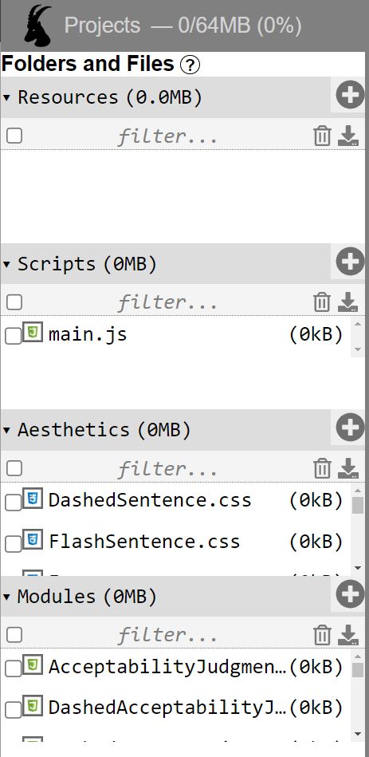

```{r setup, include=FALSE}
### Ibex - https://spellout.net/ibexexps/skku_ibex/workshop_example/experiment.html
# ID: skku_ibex
# PW: 2021workshop

options(htmltools.dir.version = FALSE)
library(icon)
```

```{r xaringan-themer, include=FALSE, warning=FALSE}
library(xaringanthemer)
style_duo_accent(
  primary_color = "#011F5b",
  secondary_color = "#990000",
  inverse_header_color = "#FFFFFF"
)
xaringanExtra::use_tachyons()
xaringanExtra::use_editable()
xaringanExtra::use_tachyons()
```


```{css, echo = FALSE}
a {
  color: black;
  text-decoration: underline;
}

.showme:hover + .hide {
  display: block;
}

.hide {
  display: none;
}

.hide:hover {
  display: block;
}

.hljs-github .hljs-string {
  color: black;
}

.hljs-github .hljs-number {
  color: black;
}

.blue{
  font-weight: bold;
  color: #003087;
}

.green{
  font-weight: bold;
  color: #006747;
}

.orange{
  font-weight: bold;
  color: #FB5315;
}

.purple{
  font-weight: bold;
  color: #9312A0;
}

.bl {
  font-weight: bold;
  color: black;
  border: 0px;
}

.super{
  vertical-align: super;
  font-size: .5em;
}

.sub{
  vertical-align: sub;
  font-size: .5em;
 }

/*-- 3 column layout --*/
.left-col {
  width: 29%;
  text-align: left;
  padding-left: 20px;
  padding-right: 20px;
  float: left;
}

.center-col {
  width: 29%;
  text-align: left;
  padding-left: 20px;
  padding-right: 20px;
  float: left;
}

.right-col {
  width: 29%;
  text-align: left;
  padding-left: 20px;
  padding-right: 20px;
  float: left;
}

/* five-column layout */

/*.flex {
  display: flex;
  justify-content: center;
  align-items: flex-start;
}
.column {
  float: left;
  width: 25%;
  text-align: center;
}*/

/*.columns { display: flex; }*/

.pull-left {
  padding-top: 0px;
}

.pull-left-narrow {
  float: left;
  width: 20%;
}

.pull-right-wide {
  float: right;
  width: 75%;
}

/* Clear floats after the columns */
.pull-right-wide + * { clear: both; }

/*-- CUSTOM CLASSES FOR EDUCATIONAL PURPOSES ---------------------------------*/

/* Pull */
.pull-left-color {
  float: left;
  width: 47%;
  background-color: var(--my-pink);
}

.pull-right-color {
  float: right: 47%;
}

/* Two-column layout */
.left-column-color {
  background-color: var(--my-coral);
  width: 20%;
  height: 92%;
  float: left;
}
.left-column-color h2:last-of-type, .left-column h3:last-child {
  color: #000;
}
.right-column-color {
  background-color: var(--my-pink);
  width: 75%;
  float: right;
  padding-top: 1em;
}
```

# Presentation Outline

.pull-left-narrow[.center[
  
]]

.pull-right-wide[.middle[]
  Introduction to [IBEX](https://spellout.net/ibexfarm)
  - Basic ideas
  - Navigating the platform
]

--

.pull-left-narrow[.center[
  &nbsp;
  `r icon_style(fontawesome("code", style = "solid"), scale = 4, fill = "#006747")`
]]

.pull-right-wide[
  Scripting an experiment
  - Overview of critical components
  - Code walkthrough
]

--

.pull-left-narrow[.center[
  &nbsp;
  `r icon_style(fontawesome("file", style = "solid"), scale = 4, fill = "#768692")`
]]

.pull-right-wide[
  Data Analysis
  - Understanding the output format
  - Importing into R
]

---

class: middle, center

# Introduction to IBEX

---

# What is IBEX?

- <p>Stands for (I)nternet-(B)ased (EX)periments</p>

--

- <strong style="color:#006747;">DOES</strong>:

--

    - Host experiments with webpage links
--

    - Log user interactions
--

    - Store data on a secure server

--

- **DOES NOT**:

--

    - Recruit participants (_see_ Amazon Mechanical Turk)
--

    - Provide an analysis of the results (_see_ R, Python) 


---

# Where does IBEX fit?

```{r, echo = FALSE, fig.align='center', out.width="450px"}
knitr::include_graphics("img/workflow_abstract.jpg")
```

---

# Where does IBEX fit?

```{r, echo = FALSE, fig.align='center', out.width="450px"}
knitr::include_graphics("img/workflow_tools.png")
```

---

# Navigating IBEX

- <p>Go to <a href='https://spellout.net/ibexfarm'>https://spellout.net/ibexfarm</a> </p>

- Click <strong style='color:#006295'>create an account</strong> (or <strong style='color:#006295'>log in</strong>)

- Click <strong style='color:#006295'>manage my experiments</strong>

- Click <strong style='color:#006295'>Create a new experiment</strong>

- Give it a unique name like "_workshop_example_"

- Done!

```{r, echo = FALSE, fig.align='center', out.width="500px", out.extra='style="border:2px solid black; margin:auto; display:block;margin-top:30px"'}
knitr::include_graphics("img/create_exp.png")
```

---

# Navigating IBEX

<video controls width="800" height="500">
<source src="vid/ibex_login.mp4" type="video/mp4">
</video>

---

<h1 style='margin-bottom:0px'>Experiment file structure</h1>

.pull-left[

**chunk_includes**
- Stand-alone files go here

**css_includes**
- Style specifications go here

**data_includes**
- Experiment scripts go here

**js_includes**
- Modules ("controllers") go here

**results** & **server_state**
- Automatically generated/updated

]


.pull-right[
```{r, echo = FALSE, out.width = "280px"}

```
]

---

```{css, echo = FALSE}
.deemph {
  color: #bebebe;
}
```


<h1 style='margin-bottom:0px'>Experiment file structure</h1>

.pull-left[

<strong style='color:#bebebe'>chunk_includes</strong>
- .deemph[Stand-alone files go here]

<strong style='color:#bebebe'>css_includes</strong>
- .deemph[Style specifications go here]

**data_includes**
- Experiment scripts go here

<strong style='color:#bebebe'>js_includes</strong>
- .deemph[Modules ("controllers") go here]

<strong style='color:#bebebe'>results</strong> .deemph[&] <strong style='color:#bebebe'>server_state</strong>
- .deemph[Automatically generated/updated]

]


.pull-right[
```{r, echo = FALSE, out.width = "280px"}

```
]


---

class: middle, center

# Scripting an experiment


---

# The script

Only need to modify **one file**: _example_data.js_ (can also be renamed later)

At creation, the default file looks like this:

<embed style='border: 1px solid black' type="text/html" src="ibex_files/example_data.js"  width="800" height="300">

The above script creates [this self-paced reading experiment](https://spellout.net/ibexexps/example/example/experiment.html).


---

# Writing your own script

The _example_data.js_ script works, but is not very friendly.

We'll use **our own file** - <em><a href="ibex_files/template.js" download>template.js</a></em> - to demonstrate how the script works.

<embed style='border: 1px solid black' type="text/html" src="ibex_files/template.js"  width="800" height="300">

The above script creates [this acceptability rating experiment](https://spellout.net/ibexexps/skku_ibex/workshop_example/experiment.html).

---

# A simple layout

.pull-left[

```{r, echo = FALSE, out.width = "400px"}

```

]


.pull-right[

**Editing the script**

When you open the `.js` file in the `data_includes` section of your experiment on Ibex, it will open up a text editor.

]

---

# A simple layout

.pull-left[

```{r, echo = FALSE, out.width = "400px"}

```

]


.pull-right[

**Editing the script**

When you open the `.js` file in the `data_includes` section of your experiment on Ibex, it will open up a text editor.

Options for editing the file:

- Make changes directly on IBEX

- Download the file and open with an .bl[editor] that supports **JavaScript** syntax checking (e.g., [Atom](https://atom.io/))

]

---

# A simple layout

.pull-left[

```{r, echo = FALSE, out.width = "400px"}

```

]


.pull-right[

**Parts of the Script**

.bl[Settings]:
- Sets various options for the experiment

.bl[Sequence] (`shuffleSequence`):

- Specifies the ordering of the different parts of the experiment

.bl[Body] (`items`):

- Includes the actual material that will be shown to the participants


]

---

# A simple layout

.pull-left[

```{r, echo = FALSE, out.width = "400px"}
knitr::include_graphics("img/template_layout_3.png")
```

]


.pull-right[

**Body**

.bl[Forms]

- Introduction page, consent form, directions, language background, demographic information, etc.

.bl[Trials]

- All stimuli for the experiment

- _Practice_, _Critical_, _Filler_

- Can be accompanied by messages, questions, etc.

]

---

<h1 style='margin-bottom:0px'>Walkthrough of the components</h1>

```{r, echo = FALSE, fig.align='center', out.width = "500px"}

```

---

# But first, the experiment design

--

**Study**: We are interested in how people recover from .bl[garden-path sentences].

--

.center["While Anna dressed the kitten paid attention."]

--

.center[... *[.sub[VP] dressed the kitten], ...]

--

.center[... <span style='vertical-align:super; font-size:.7em'>✓</span>[.sub[VP] dressed], the kitten ...]

--

**Hypothesis**: Verbs that are frequently .blue[transitive] make recovery more difficult, compared to verbs that are frequently .green[intransitive].

--

.center[(transitive) - "While Anna .blue[_trained_] the kitten paid attention."]

--

.center[(intransitive) - "While Anna .green[_dressed_] the kitten paid attention."]

--

**Prediction**: Lower .bl[acceptability ratings] in the transitive condition (.blue[_gp.trans_]) than in the intransitive condition (.green[_gp.intrans_]).

--

<br>

.center[.bl[Note: this is a _within-participant_ design!]]

---

# Translating the design to code

For the gp.trans condition, the first stimuli in our acceptability judgement experiment is the sentence "While Anna trained the kitten paid attention".

--

\[
<br>
$\quad$
\[ "gp.trans", 1 \],
<br>
$\quad$
"AcceptabilityJudgment",
<br>
$\quad$
{s: "While Anna trained the kitten paid attention."}
<br>
\]

---

# Translating the design to code

For the .blue[gp.trans condition], the first stimuli in our acceptability judgement experiment is the sentence "While Anna trained the kitten paid attention".

\[
<br>
$\quad$
\[ ".blue[gp.trans]", 1 \],
<br>
$\quad$
"AcceptabilityJudgment",
<br>
$\quad$
{s: "While Anna trained the kitten paid attention."}
<br>
\]

---

# Translating the design to code

For the .blue[gp.trans condition], the **first stimuli** in our acceptability judgement experiment is the sentence "While Anna trained the kitten paid attention".

\[
<br>
$\quad$
\[ ".blue[gp.trans]", **1** \],
<br>
$\quad$
"AcceptabilityJudgment",
<br>
$\quad$
{s: "While Anna trained the kitten paid attention."}
<br>
\]


---

# Translating the design to code

For the .blue[gp.trans condition], the **first stimuli** in our .bl[acceptability judgement experiment] is the sentence "While Anna trained the kitten paid attention".

\[
<br>
$\quad$
\[ ".blue[gp.trans]", **1** \],
<br>
$\quad$
".bl[AcceptabilityJudgment]",
<br>
$\quad$
{s: "While Anna trained the kitten paid attention."}
<br>
\]

---

# Translating the design to code

For the .blue[gp.trans condition], the **first stimuli** in our .bl[acceptability judgement experiment] is the .purple[sentence] "While Anna trained the kitten paid attention". 

\[
<br>
$\quad$
\[ ".blue[gp.trans]", **1** \],
<br>
$\quad$
".bl[AcceptabilityJudgment]",
<br>
$\quad$
{.purple[s]: "While Anna trained the kitten paid attention."}
<br>
\]


---

# Translating the design to code

For the .blue[gp.trans condition], the **first stimuli** in our .bl[acceptability judgement experiment] is the .purple[sentence] .orange["While Anna trained the kitten paid attention"]. 

\[
<br>
$\quad$
\[ ".blue[gp.trans]", **1** \],
<br>
$\quad$
".bl[AcceptabilityJudgment]",
<br>
$\quad$
{.purple[s]: .orange["While Anna trained the kitten paid attention."]}
<br>
\]

--

This can be put into a single line:

```{r, eval=FALSE}
[["gp.trans",1], "AcceptabilityJudgment", {s: "While Anna trained the kitten paid attention."}]
```

---

# Translating the design to code

For the .green[gp.intrans condition], the **first stimuli** in our .bl[acceptability judgement experiment] is the .purple[sentence] .orange["While Anna dressed the kitten paid attention"]. 

\[
<br>
$\quad$
\[ ".green[gp.trans]", **1** \],
<br>
$\quad$
".bl[AcceptabilityJudgment]",
<br>
$\quad$
{.purple[s]: .orange["While Anna dressed the kitten paid attention."]}
<br>
\]

This can be put into a single line:

```{r, eval=FALSE}
[["gp.intrans",1], "AcceptabilityJudgment", {s: "While Anna dressed the kitten paid attention."}]
```

---

# Practice

Item set #2:

.center[(transitive) - "Since Dave improved the department was satisfied."]

.center[(intransitive) - "Since Dave worried the counselor devised a plan."]

.can-edit[
```{r, eval=FALSE}
<code here>
```
]

<div class="showme">Hover for answer</div>

.hide[
```{r, eval = FALSE}
[["gp.trans",2],
  "AcceptabilityJudgment",
  {s: "Since Dave improved the department was satisfied."}],
[["gp.intrans",2],
  "AcceptabilityJudgment",
  {s: "Since Dave worried the counselor devised a plan."}]
```
]

---

# Practice

Item set #2:

.center[(transitive) - "Since Dave improved the department was satisfied."]

.center[(intransitive) - "Since Dave worried the counselor devised a plan."]

.can-edit[
```{r, eval=FALSE}
[["gp.trans",2],
  "AcceptabilityJudgment",
  {s: "Since Dave improved the department was satisfied."}],
[["gp.intrans",2],
  "AcceptabilityJudgment",
  {s: "Since Dave worried the counselor devised a plan."}]
```
]

```{r, eval = FALSE}
[["gp.trans",2],
  "AcceptabilityJudgment",
  {s: "Since Dave improved the department was satisfied."}],
[["gp.intrans",2],
  "AcceptabilityJudgment",
  {s: "Since Dave worried the counselor devised a plan."}]
```


---

# Putting it together

Need to separate them out by commas:

```{r}

```


